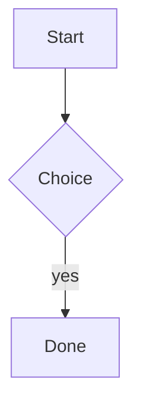

# Fences the web layer post-processes

Inline math $E = mc^2$ and display math:

$$
\int_0^1 x^2 \, dx = \frac{1}{3}
$$



```swift
func render(_ markdown: String) -> String { "" }
```

```
no language
```

Unclosed fence handling:

```python
print("still open")
