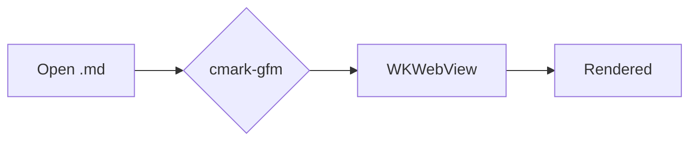

# tvmv Showcase

## Text
**Bold**, *italic*, ~~strikethrough~~, `inline code`, and a link to <https://example.com>.

> A blockquote with a nested list:
> - item one
> - item two
>   - nested

## Table
| Feature | Status |
|---|---|
| Tables | ✅ |
| Task lists | ✅ |

## Task list
- [x] Parse GFM
- [ ] Conquer the world

## Code
```swift
func greet(_ name: String) -> String { "Hello, \(name)" }
```

```python
def greet(name): return f"Hello, {name}"
```

## Math
Inline $E = mc^2$ and display:

$$\int_0^\infty e^{-x^2}\,dx = \frac{\sqrt{\pi}}{2}$$

## Diagram

