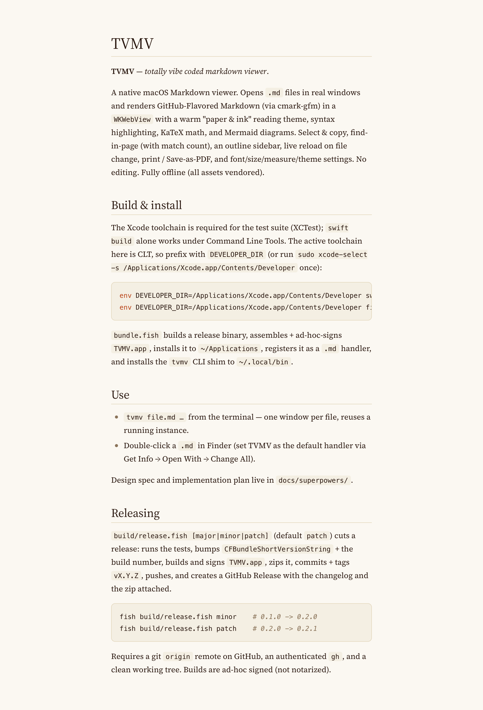
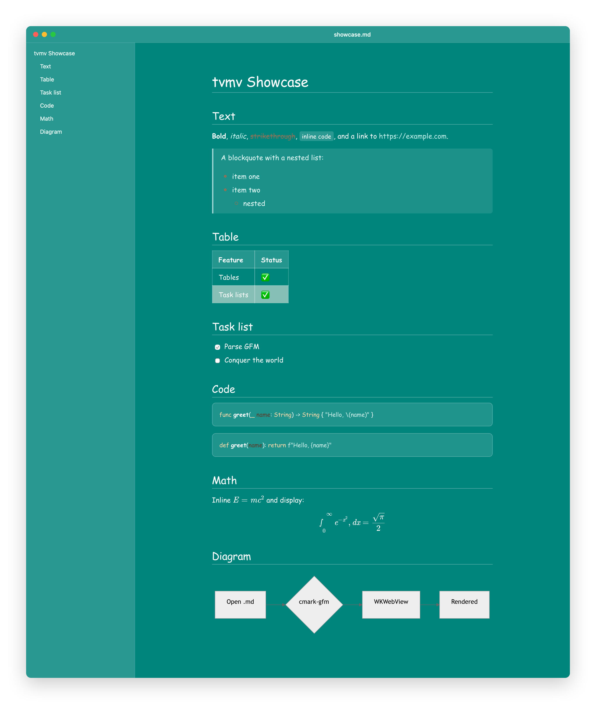

# TVMV

**TVMV** — *totally vibe coded markdown viewer*.



A native macOS Markdown viewer. Opens `.md` files in real windows and renders
GitHub-Flavored Markdown (via cmark-gfm) in a `WKWebView` with a warm "paper &
ink" reading theme, syntax highlighting, KaTeX math, and Mermaid diagrams.
Select & copy, find-in-page (with match count), an outline sidebar, live reload
on file change, print / Save-as-PDF, and font/size/measure/theme settings. No
editing. Fully offline (all assets vendored).

## Build & install

The Xcode toolchain is required for the test suite (XCTest); `swift build` alone
works under Command Line Tools. The active toolchain here is CLT, so prefix with
`DEVELOPER_DIR` (or run `sudo xcode-select -s /Applications/Xcode.app/Contents/Developer` once):

```sh
env DEVELOPER_DIR=/Applications/Xcode.app/Contents/Developer swift test
env DEVELOPER_DIR=/Applications/Xcode.app/Contents/Developer fish build/bundle.fish
```

`bundle.fish` builds a release binary, assembles + ad-hoc-signs `TVMV.app`,
installs it to `~/Applications`, registers it as a `.md` handler, and installs
the `tvmv` CLI shim to `~/.local/bin`.

## Use

- `tvmv file.md …` from the terminal — one window per file, reuses a running instance.
- Double-click a `.md` in Finder (set TVMV as the default handler via Get Info → Open With → Change All).

Design spec and implementation plan live in `docs/superpowers/`.

## QuickLook

TVMV bundles a QuickLook **preview extension**, so pressing Space on a `.md` file
in Finder renders it with the same theme (cmark-gfm + the warm reading CSS). It's
installed with the app under `~/Applications`. If another markdown QuickLook
extension is also installed (e.g. QLMarkdown), macOS may pick that one instead —
choose TVMV under **System Settings → General → Login Items & Extensions → Quick
Look** (enable TVMV, disable the other). The extension is ad-hoc signed with the
`com.apple.security.app-sandbox` entitlement (required for QuickLook to load it).

## Custom themes (CSS)

Out of the box TVMV wears its built-in "paper & ink" theme, which has taste. If
you don't, you can override it with your own CSS — TVMV won't judge.

Open **Settings (⌘,) → Custom CSS → Choose…** and pick a `.css` file. TVMV injects
it after the built-in theme (overriding it), tints the window chrome — sidebar,
window, and title bar — to a slightly-lightened version of your background color,
and **live-reloads** as you edit the file. *Reset to default* goes back to the
built-in theme. Nothing is loaded unless you pick a file.

Try [`examples/comic-msd.css`](examples/comic-msd.css) — Comic Sans on MSD teal:



Writing your own: plain element rules (`#content.markdown-body …`) override
directly; to override the typography **variables** (`--tvmv-body-font`,
`--tvmv-base-size`, …) add `!important`, since the app sets those inline for live
Settings updates.

## Releasing

`build/release.fish [major|minor|patch]` (default `patch`) cuts a release:
runs the tests, bumps `CFBundleShortVersionString` + the build number, builds and
signs `TVMV.app`, zips it, commits + tags `vX.Y.Z`, pushes, and creates a GitHub
Release with the changelog and the zip attached.

```sh
fish build/release.fish minor    # 0.1.0 -> 0.2.0
fish build/release.fish patch    # 0.2.0 -> 0.2.1
```

Requires a git `origin` remote on GitHub, an authenticated `gh`, and a clean
working tree. Builds are ad-hoc signed (not notarized).
