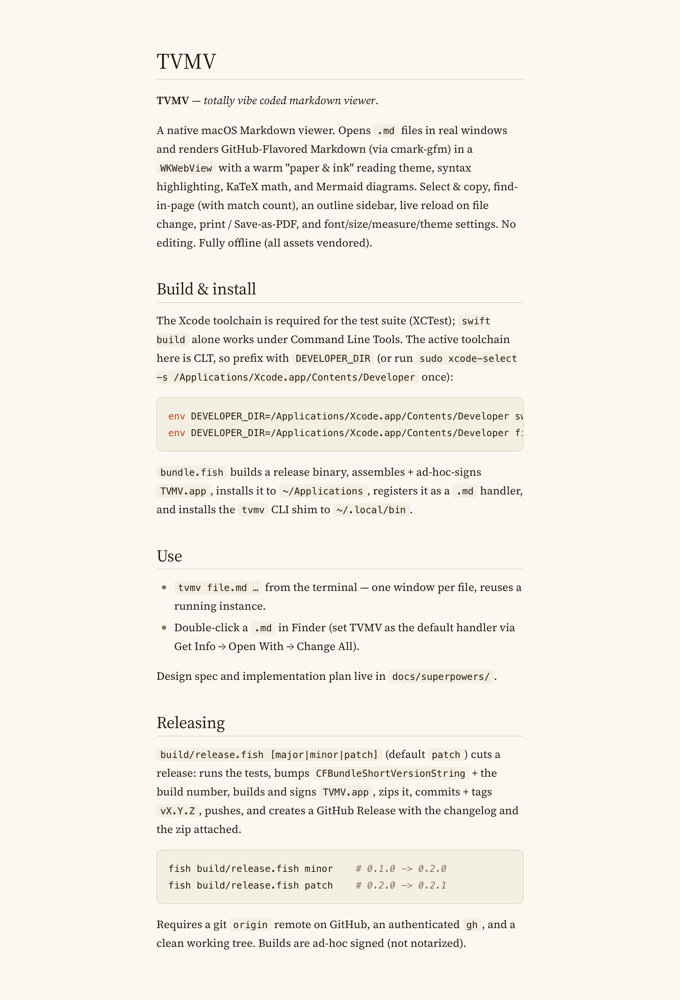
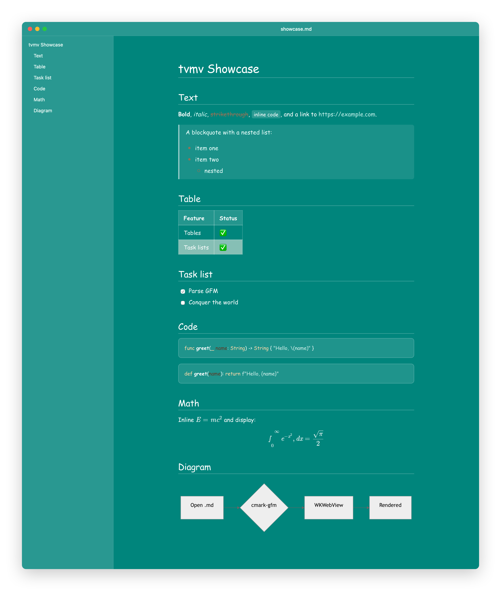

# TVMV

**TVMV** — *totally vibe coded markdown viewer*.



A native Markdown viewer and editor for macOS, iOS and Linux. Opens `.md` files
in real windows and renders GitHub-Flavored Markdown (via cmark-gfm) with a warm
"paper & ink" reading theme, syntax highlighting, KaTeX math, and Mermaid
diagrams. Select & copy, find-in-page (with match count), an outline sidebar,
a CodeMirror editor with live preview, live reload on file change, print /
Save-as-PDF, and font/size/measure/theme settings. Fully offline — all assets
are vendored.

The rendering layer (`Sources/TVMVCore/Resources/web/`) is shared verbatim by
all three platforms; only the shell differs — SwiftUI + `WKWebView` on Apple
platforms, Rust + GTK4 + WebKitGTK on Linux. Both link the same pinned
cmark-gfm revision, so the HTML is byte-identical.

## Build & install

The Xcode toolchain is required for the test suite (XCTest); `swift build` alone
works under Command Line Tools. The active toolchain here is CLT, so prefix with
`DEVELOPER_DIR` (or run `sudo xcode-select -s /Applications/Xcode.app/Contents/Developer` once):

```sh
env DEVELOPER_DIR=/Applications/Xcode.app/Contents/Developer swift test
env DEVELOPER_DIR=/Applications/Xcode.app/Contents/Developer fish build/bundle.fish
```

`bundle.fish` builds a release binary, assembles and signs `TVMV.app`, installs
it to `/Applications`, registers it as a `.md` handler, and installs the `tvmv`
CLI shim to `~/.local/bin`. Dev builds and releases share one install location
on purpose — with two registered copies, LaunchServices and QuickLook choose
between them on their own terms, so a stale copy can quietly serve old builds.
Any leftover install under `~/Applications` is unregistered and removed.

Signing is resolved by `build/signing.fish`: it uses a **Developer ID
Application** certificate when one is in the keychain, and falls back to an
ad-hoc signature otherwise (fine for local use, but such a build runs only on
the machine that produced it). Set `TVMV_IDENTITY` to force a specific identity,
or `TVMV_IDENTITY=-` to force ad-hoc. The hardened runtime is enabled in both
modes so local builds exercise exactly what ships.

## Use

- `tvmv file.md …` from the terminal — one window per file, reuses a running instance.
- Double-click a `.md` in Finder (set TVMV as the default handler via Get Info → Open With → Change All).

Design spec and implementation plan live in `docs/superpowers/`.

## QuickLook

TVMV bundles a QuickLook **preview extension**, so pressing Space on a `.md` file
in Finder renders it with the same theme (cmark-gfm + the warm reading CSS). It's
installed with the app under `/Applications`. If another markdown QuickLook
extension is also installed (e.g. QLMarkdown), macOS may pick that one instead —
choose TVMV under **System Settings → General → Login Items & Extensions → Quick
Look** (enable TVMV, disable the other). The extension is signed with the
`com.apple.security.app-sandbox` entitlement (required for QuickLook to load it).

## iOS (iPad & iPhone)

TVMV also builds as a universal iOS document app sharing the same core
(`TVMVCore`): the Files browser opens/creates `.md` documents, and rendering,
editing, find, and the theme use the identical pipeline. Requires Xcode +
XcodeGen:

```sh
fish build/ios.fish        # generate ios/TVMV.xcodeproj and build
fish build/ios.fish run    # + install and launch in the iPad simulator
```

The Mac app and its build pipeline are unaffected; `ios/project.yml` is the
committed project definition (the `.xcodeproj` is generated). Known issue: the
launch scene's *Create Document* fails on simulators without an iCloud account
(NSFileProvider -1005); opening existing documents is unaffected.

## Linux

A native GTK4 + WebKitGTK app sharing the **same** web layer as the Mac app —
`app.css`, `boot.js`, the CodeMirror editor and the vendored KaTeX / Mermaid /
highlight.js are used unmodified, so a document renders identically on both.
Only the shell is rewritten (Rust, in `linux/`); no Swift is ported.

```sh
sudo apt install libgtk-4-dev libwebkitgtk-6.0-dev pkg-config   # Ubuntu 24.04
fish build/linux.fish                # build + install to /usr/local
PREFIX=$HOME/.local fish build/linux.fish     # or per-user, no root
fish build/linux.fish uninstall
```

Installs the binary, web assets, desktop entry, icons, the thumbnailer, the
AppArmor profile, and — where the bindings are present — a file-manager context
menu. `cargo test --manifest-path linux/Cargo.toml` runs the suite.

### Use

- `tvmv file.md …` — one window per file, reusing a running instance.
- `tvmv` with no file opens a document chooser.
- Double-click a `.md` in Files; the installer registers TVMV as the handler.
- Right-click → **Preview with TVMV** (needs `python3-nautilus`).

| | |
|---|---|
| `Ctrl+E` | editor pane | 
| `Ctrl+S` | save |
| `Ctrl+F` | find, with match count |
| `F9` | outline sidebar |
| `Ctrl+P` / `Ctrl+Shift+P` | print / save as PDF |
| `Ctrl+,` | settings |

Non-interactive modes: `--html`, `--pdf out.pdf in.md`, `--peek file.md`
(chromeless preview), `--thumbnail in.md out.png 256`.

### Two things specific to Linux

**Scrolling on NVIDIA.** Debian and Ubuntu patch WebKitGTK to disable its dmabuf
renderer whenever an NVIDIA proprietary driver is present, which forces every
frame through a CPU copy: measured here, that cost a full core and dropped a
1200×1200 window from 61 fps to 20. TVMV sets `WEBKIT_FORCE_DMABUF_RENDERER=1`
(the same patch's own override) at startup. `TVMV_NO_FORCE_DMABUF=1` opts out.
Upstream WebKit declined that patch — it is distribution-only.

**The WebKit sandbox.** Ubuntu 24.04 denies unprivileged user namespaces to
unconfined processes, which bubblewrap needs. The installer adds an AppArmor
profile (modelled on Ubuntu's own `epiphany` one) so TVMV runs sandboxed. Run
straight out of `linux/target/` there is no profile, so it detects the kernel
policy and falls back with a warning rather than aborting.

### Not done

No Flatpak recommendation (it measured slower and picks up the runtime's theming
rather than the desktop's), no `.deb`, no AppStream metainfo. Dolphin gets no
thumbnails: it ignores freedesktop `.thumbnailer` files and needs a KIO plugin,
and while the C ABI that plugin would draw through is built and tested
(`tvmv_card_render_png`), **the C++ shim itself is not written** — this machine
has neither `cmake` nor the KDE development packages. `linux/kio-thumbnail/README.md`
records the build recipe and the KF5/KF6 detection Ubuntu 24.04 forces. GNOME
Sushi's spacebar preview cannot be extended: its viewers are compiled into
gresource bundles with no plugin API.

## Custom themes (CSS)

Out of the box TVMV wears its built-in "paper & ink" theme, which has taste. If
you don't, you can override it with your own CSS — TVMV won't judge.

Open **Settings (⌘,) → Custom CSS → Choose…** and pick a `.css` file. TVMV injects
it after the built-in theme (overriding it), tints the window chrome — sidebar,
window, and title bar — to a slightly-lightened version of your background color,
and **live-reloads** as you edit the file. *Reset to default* goes back to the
built-in theme. Nothing is loaded unless you pick a file.

Try [`examples/comic-msd.css`](examples/comic-msd.css) — Comic Sans on MSD teal:



Writing your own: plain element rules (`#content.markdown-body …`) override
directly; to override the typography **variables** (`--tvmv-body-font`,
`--tvmv-base-size`, …) add `!important`, since the app sets those inline for live
Settings updates.

## Releasing

`build/release.fish [major|minor|patch]` (default `patch`) cuts a release: runs
the tests, bumps `CFBundleShortVersionString` + the build number, builds and
Developer ID signs `TVMV.app`, notarizes it with Apple and staples the ticket,
packages a `.zip` and a notarized `.dmg`, commits + tags `vX.Y.Z`, pushes, and
creates a GitHub Release with the changelog and both assets attached.

```sh
fish build/release.fish minor    # 0.1.0 -> 0.2.0
fish build/release.fish patch    # 0.2.0 -> 0.2.1
```

Releases are Developer ID signed, notarized, and stapled, so they launch
normally on any Mac — no Gatekeeper prompt and no `xattr` workaround.

Requires a git `origin` remote on GitHub, an authenticated `gh`, a clean working
tree, a Developer ID Application certificate, and a `notarytool` keychain profile
named `tvmv-notary` (override with `TVMV_NOTARY_PROFILE`). Create the profile
once with an App Store Connect API key:

```sh
xcrun notarytool store-credentials tvmv-notary \
    --key <AuthKey_XXXXXXXXXX.p8> --key-id <KEYID> --issuer <ISSUER-UUID>
```

Notarization needs network access and takes a few minutes per submission; a
release makes two (the app, then the disk image). The script fails fast if the
certificate or the notary profile is missing, and reverts its version stamp if
anything downstream fails.
