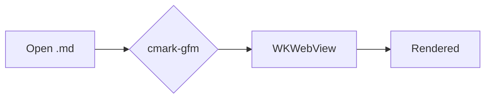

# tvmv Markdown Viewer — Implementation Plan

> **For agentic workers:** REQUIRED SUB-SKILL: Use superpowers:subagent-driven-development (recommended) or superpowers:executing-plans to implement this plan task-by-task. Steps use checkbox (`- [ ]`) syntax for tracking.

**Goal:** A native macOS document-based Markdown viewer (`tvmv`) that opens `.md` files in real windows — GitHub-faithful rendering, select/copy, font override, math, diagrams, syntax highlighting, live reload, outline, find, and print — built as a SwiftPM executable bundled into `tvmv.app`.

**Architecture:** Markdown is parsed to HTML in Swift with **cmark-gfm**; a per-window **`WKWebView`** displays it, styled with **`github-markdown-css`** plus a user-tunable typography layer, and enriched **lazily in JavaScript** (highlight.js / KaTeX / Mermaid). The app shell is **SwiftUI `DocumentGroup(viewing:)`** (read-only document app) with an AppKit-bridged web view, a custom `tvmv-asset://` scheme handler serving bundled assets and the document's own folder, a `DispatchSource` file watcher for live reload, and a Settings scene for typography.

**Tech Stack:** Swift 6 (tools 6.0), SwiftUI + AppKit + WebKit, `apple/swift-cmark` (`gfm` branch), vendored JS (highlight.js, KaTeX, Mermaid, github-markdown-css), fish build scripts.

## Provenance of the code in this plan

Every code block below is **verified**, not hypothesized. Six subsystems were empirically compiled/run during design:

| Subsystem | Verified by | Source location |
|---|---|---|
| cmark-gfm renderer | `swift build` + run, GFM HTML asserted | **embedded in this plan** (Task 2) |
| FileWatcher | `swift build` (strict concurrency) + 4 runtime scenarios | **embedded in this plan** (Task 7) |
| WKWebView bridge | `swift build`, all signatures compiler-confirmed | `.verify/webview/Sources/tvmv/` |
| Web/JS layer | full pipeline run in a real WKWebView | `.verify/web/` |
| SwiftUI doc app | `swift build` | `.verify/app/Sources/tvmv/` |
| Bundling + CLI | real `.app` assemble + codesign + lsregister + `open` | `.verify/bundle/` |

`.verify/` is **gitignored scratch from the design session**. Tasks that say "copy from `.verify/…`" rely on it persisting through execution; if it was cleaned, the four embedded-by-reference files can be regenerated, but for this session they are present. Tasks apply explicit edits (the integration fixes) after copying.

---

## Global Constraints

Copied verbatim from the verified design — every task implicitly includes these.

- **swift-tools-version:** `6.0`; Swift 6 language mode (strict concurrency clean).
- **Deployment target:** `.macOS(.v14)` (built against the macOS 26 SDK; nothing requires 26-only API). `LSMinimumSystemVersion` = `14.0` (must match).
- **Markdown engine:** `.package(url: "https://github.com/apple/swift-cmark.git", branch: "gfm")`; products `cmark-gfm` + `cmark-gfm-extensions`; importable modules `cmark_gfm` + `cmark_gfm_extensions` (underscored). Pin reproducibly via `Package.resolved` (verified revision `0101bf2c6ff6a218f93150f340fe5ccf76d9f3aa`).
- **GFM extensions registered:** `table`, `strikethrough`, `autolink`, `tasklist`. Call `cmark_gfm_core_extensions_ensure_registered()` before `cmark_find_syntax_extension`. Pass `cmark_parser_get_syntax_extensions(parser)` to `cmark_render_html`. Options `CMARK_OPT_DEFAULT` (raw HTML escaped — safe).
- **Vendored asset versions (offline, committed):** github-markdown-css `5.8.1` (MIT), highlight.js `11.11.1` (BSD-3-Clause), KaTeX `0.16.22` (MIT), Mermaid `11.15.0` (MIT).
- **Custom scheme:** `tvmv-asset`; host routing `app/` → bundled `web/`, `doc/` → open document's directory (path-traversal-confined).
- **JS bridge:** native→JS calls go through `window.tvmv.{render,applyStyle,scrollToAnchor,setTheme,getScrollRatio,setScrollRatio}`. JS→native messages post to handler name `"tvmv"` with `{type:"outline"|"renderComplete"|"error", …}`.
- **applyStyle JSON keys (exact):** `bodyFont`, `monoFont`, `baseSize` (number→px), `measure` (number→ch), `fullWidth` (bool), `theme` (`"light"|"dark"`).
- **Default typography:** body font `Source Serif 4`; mono `Menlo`; base size `16`; measure `72`ch; theme `auto`.
- **Resource bundle:** SwiftPM emits `tvmv_tvmv.bundle` (flat dir, `web/` inside). In the `.app` it MUST live at `Contents/Resources/tvmv_tvmv.bundle` (NOT the `.app` root — root placement breaks `codesign`). Locate it at runtime via the custom `WebResources` locator, **not** `Bundle.module`.
- **App identity:** `CFBundleIdentifier` = `dk.dyregod.tvmv`; `CFBundleName`/`CFBundleExecutable` = `tvmv`; `NSPrincipalClass` = `NSApplication`.
- **Codesign:** ad-hoc `codesign -s - --deep --force <App>.app` (succeeds only with the resource bundle under `Contents/Resources`).
- **CLI shim:** `open -a <abs path to tvmv.app> <resolved files…>` — files as operands (NOT `--args`, NO `--`); reuses a running instance; one window per file. Resolve args with fish `path resolve`.
- **lsregister:** `/System/Library/Frameworks/CoreServices.framework/Frameworks/LaunchServices.framework/Support/lsregister -f <App>.app`.

---

## File structure

```
tvmv/
  Package.swift
  Package.resolved                      (committed — pins swift-cmark)
  Sources/tvmv/
    main? → replaced by App.swift        (no main.swift once App.swift exists)
    App.swift                            (verified — .verify/app)
    MarkdownDocument.swift               (verified — .verify/app; edited to use MarkdownText)
    MarkdownText.swift                   (NEW — shared decode helper)
    MarkdownRenderer.swift               (verified — embedded Task 2)
    OutlineItem.swift                    (NEW — replaces stub)
    AppSettings.swift                    (NEW — replaces stub)
    SettingsView.swift                   (NEW — replaces stub)
    ViewerModel.swift                    (NEW)
    ViewerWindow.swift                   (NEW — replaces stub)
    MarkdownWebView.swift                (verified — .verify/webview; edited: onReady + window.tvmv.*)
    AssetSchemeHandler.swift             (verified — .verify/webview)
    FileWatcher.swift                    (verified — embedded Task 7)
    ResourceLocator.swift                (verified — .verify/bundle)
    Resources/web/
      template.html  app.css  boot.js    (verified — .verify/web)
      vendor.json  vendor.fish           (verified — .verify/web)
      vendor/…                           (downloaded by vendor.fish, committed)
  Tests/tvmvTests/
    MarkdownRendererTests.swift  MarkdownTextTests.swift
    AppSettingsTests.swift  FileWatcherTests.swift
  build/
    Info.plist  bundle.fish  tvmv        (verified — .verify/bundle)
  Fixtures/showcase.md                   (NEW)
  THIRD-PARTY-LICENSES.md                (NEW)
```

---

## Task 1: Project skeleton (builds, empty viewer)

Establish a compiling SwiftPM executable + test target with the cmark dependency, before any feature code.

**Files:**
- Create: `Package.swift`
- Create: `Sources/tvmv/main.swift` (temporary entry point, deleted in Task 10)
- Create: `Sources/tvmv/Resources/web/.keep`
- Create: `Tests/tvmvTests/PlaceholderTests.swift` (so the test target resolves; SwiftPM errors if `Tests/tvmvTests/` is absent)

**Interfaces:**
- Produces: a buildable package named `tvmv` with products `cmark-gfm` + `cmark-gfm-extensions` linked and a `tvmvTests` target.

- [ ] **Step 1: Write `Package.swift`** (resources line included; `Resources/web` must exist or SwiftPM errors)

```swift
// swift-tools-version: 6.0
import PackageDescription

let package = Package(
    name: "tvmv",
    platforms: [.macOS(.v14)],
    dependencies: [
        .package(url: "https://github.com/apple/swift-cmark.git", branch: "gfm")
    ],
    targets: [
        .executableTarget(
            name: "tvmv",
            dependencies: [
                .product(name: "cmark-gfm", package: "swift-cmark"),
                .product(name: "cmark-gfm-extensions", package: "swift-cmark")
            ],
            resources: [.copy("Resources/web")]
        ),
        .testTarget(name: "tvmvTests", dependencies: ["tvmv"])
    ]
)
```

- [ ] **Step 2: Create the resources dir and a temporary entry point**

```bash
mkdir -p Sources/tvmv/Resources/web && touch Sources/tvmv/Resources/web/.keep
```

`Sources/tvmv/main.swift`:

```swift
// Temporary entry point so the executable target builds before App.swift exists.
// Deleted in Task 10 (App.swift provides @main).
print("tvmv")
```

`Tests/tvmvTests/PlaceholderTests.swift` (SwiftPM requires the target dir to contain at least one source):

```swift
import XCTest

final class PlaceholderTests: XCTestCase {
    func testPackageResolves() { XCTAssertTrue(true) }
}
```

- [ ] **Step 3: Build (downloads + pins swift-cmark)**

Run: `swift build`
Expected: `Build complete!`. A `Package.resolved` appears pinning `swift-cmark` to branch `gfm`.

- [ ] **Step 4: Commit**

```bash
git add Package.swift Package.resolved Sources/tvmv/main.swift Sources/tvmv/Resources/web/.keep Tests/tvmvTests/PlaceholderTests.swift
git commit -m "Scaffold tvmv SwiftPM package with cmark-gfm dependency"
```

---

## Task 2: Markdown renderer (cmark-gfm) — TDD

The GitHub-faithful core. Verified: `swift build` + run produced `<table>`, `<del>`, task-list `<input>`, `<a href>`, `<pre><code class="language-…">`, and headings with **no** `id` (anchors are added later in JS).

**Files:**
- Create: `Sources/tvmv/MarkdownRenderer.swift`
- Create: `Tests/tvmvTests/MarkdownRendererTests.swift`

**Interfaces:**
- Produces: `func renderHTML(_ markdown: String) -> String` (free function, module-internal).

- [ ] **Step 1: Write the failing tests**

`Tests/tvmvTests/MarkdownRendererTests.swift`:

```swift
import XCTest
@testable import tvmv

final class MarkdownRendererTests: XCTestCase {
    func testHeadingAndEmphasis() {
        let html = renderHTML("# Title\n\nsome **bold** text")
        XCTAssertTrue(html.contains("<h1>Title</h1>"))
        XCTAssertTrue(html.contains("<strong>bold</strong>"))
    }
    func testTableExtension() {
        let html = renderHTML("| a | b |\n|---|---|\n| 1 | 2 |")
        XCTAssertTrue(html.contains("<table>"))
    }
    func testStrikethroughAndTaskListAndAutolink() {
        let html = renderHTML("~~gone~~\n\n- [x] done\n- [ ] todo\n\nhttps://example.com")
        XCTAssertTrue(html.contains("<del>gone</del>"))
        XCTAssertTrue(html.contains("type=\"checkbox\""))
        XCTAssertTrue(html.contains("<a href=\"https://example.com\""))
    }
    func testFencedCodeCarriesLanguageClass() {
        let html = renderHTML("```swift\nlet x = 1\n```")
        XCTAssertTrue(html.contains("<pre><code class=\"language-swift\">"))
    }
    func testHeadingHasNoIdByDefault() {
        // Anchors are assigned in JS; cmark-gfm emits none.
        XCTAssertFalse(renderHTML("# Hello").contains("<h1 id"))
    }
}
```

- [ ] **Step 2: Run tests to verify they fail**

Run: `swift test --filter MarkdownRendererTests`
Expected: FAIL — `cannot find 'renderHTML' in scope`.

- [ ] **Step 3: Write `MarkdownRenderer.swift`** (verified, compiled-and-run during design)

```swift
import cmark_gfm
import cmark_gfm_extensions

/// Parse GitHub-Flavored Markdown and render it to an HTML string.
///
/// Enables the GFM core extensions: table, strikethrough, autolink, tasklist.
func renderHTML(_ markdown: String) -> String {
    // Register the GFM core extensions exactly once per process. This populates
    // the global registry queried by `cmark_find_syntax_extension`. Idempotent.
    cmark_gfm_core_extensions_ensure_registered()

    // Options bitmask. CMARK_OPT_DEFAULT (0) keeps the safe default (raw HTML and
    // javascript:/data: links stripped). Use CMARK_OPT_UNSAFE to allow raw HTML.
    let options = CMARK_OPT_DEFAULT

    guard let parser = cmark_parser_new(options) else { return "" }
    defer { cmark_parser_free(parser) }

    // Attach the four GFM extensions to the parser by their registered names.
    for name in ["table", "strikethrough", "autolink", "tasklist"] {
        if let ext = cmark_find_syntax_extension(name) {
            cmark_parser_attach_syntax_extension(parser, ext)
        }
    }

    // Feed the source bytes and build the document node tree.
    markdown.withCString { cString in
        cmark_parser_feed(parser, cString, strlen(cString))
    }
    guard let document = cmark_parser_finish(parser) else { return "" }
    defer { cmark_node_free(document) }

    // The HTML renderer needs the active extension list so extension nodes
    // (tasklist checkboxes, tables) emit their custom HTML.
    let extensions = cmark_parser_get_syntax_extensions(parser)

    guard let htmlCString = cmark_render_html(document, options, extensions) else {
        return ""
    }
    defer { free(htmlCString) }

    return String(cString: htmlCString)
}
```

- [ ] **Step 4: Run tests to verify they pass**

Run: `swift test --filter MarkdownRendererTests`
Expected: PASS (5 tests).

- [ ] **Step 5: Commit**

```bash
git add Sources/tvmv/MarkdownRenderer.swift Tests/tvmvTests/MarkdownRendererTests.swift
git commit -m "Add cmark-gfm Markdown→HTML renderer with GFM extensions"
```

---

## Task 3: Text decoding helper + read-only document — TDD

Shared UTF-8→UTF-16→Latin-1 decode used by both the document and live-reload, plus the read-only `FileDocument`.

**Files:**
- Create: `Sources/tvmv/MarkdownText.swift`
- Copy + edit: `Sources/tvmv/MarkdownDocument.swift` (from `.verify/app/Sources/tvmv/MarkdownDocument.swift`)
- Create: `Tests/tvmvTests/MarkdownTextTests.swift`

**Interfaces:**
- Produces: `enum TextEncodingUsed: String { case utf8, utf16, isoLatin1 }`; `enum MarkdownText { static func decode(_ data: Data) -> (text: String, encoding: TextEncodingUsed) }`; `struct MarkdownDocument: FileDocument` with `let text: String`, `let data: Data`, `let encodingUsed: TextEncodingUsed`, `static let markdownType: UTType`.

- [ ] **Step 1: Write the failing tests**

`Tests/tvmvTests/MarkdownTextTests.swift`:

```swift
import XCTest
@testable import tvmv

final class MarkdownTextTests: XCTestCase {
    func testUTF8() {
        let (text, enc) = MarkdownText.decode(Data("héllo".utf8))
        XCTAssertEqual(text, "héllo")
        XCTAssertEqual(enc, .utf8)
    }
    func testLatin1Fallback() {
        // 0xFF is invalid UTF-8 but valid Latin-1 (ÿ).
        let (text, enc) = MarkdownText.decode(Data([0xFF]))
        XCTAssertEqual(enc, .isoLatin1)
        XCTAssertEqual(text, "ÿ")
    }
}
```

- [ ] **Step 2: Run tests to verify they fail**

Run: `swift test --filter MarkdownTextTests`
Expected: FAIL — `cannot find 'MarkdownText' in scope`.

- [ ] **Step 3: Write `MarkdownText.swift`**

```swift
import Foundation

/// Records which text encoding successfully decoded the source bytes.
enum TextEncodingUsed: String, Sendable {
    case utf8, utf16, isoLatin1
}

/// Decodes Markdown bytes with a fallback chain so a document always shows
/// something: UTF-8 → UTF-16 (BOM) → ISO Latin-1 (maps every byte).
enum MarkdownText {
    static func decode(_ data: Data) -> (text: String, encoding: TextEncodingUsed) {
        if let s = String(data: data, encoding: .utf8) { return (s, .utf8) }
        if let s = String(data: data, encoding: .utf16) { return (s, .utf16) }
        return (String(data: data, encoding: .isoLatin1) ?? "", .isoLatin1)
    }
}
```

- [ ] **Step 4: Copy the verified `MarkdownDocument.swift` and refactor it onto `MarkdownText`**

```bash
cp .verify/app/Sources/tvmv/MarkdownDocument.swift Sources/tvmv/MarkdownDocument.swift
```

Then replace the inline decode chain in `init(configuration:)` (the `if let decoded = String(... .utf8) … else { throw … }` block) with:

```swift
        self.data = bytes
        let decoded = MarkdownText.decode(bytes)
        self.text = decoded.text
        self.encodingUsed = decoded.encoding
```

(Keep the `regularFileContents` guard, the `markdownType`/`readableContentTypes`, and `fileWrapper(configuration:)` throwing `CocoaError(.featureUnsupported)` exactly as in the verified file.)

- [ ] **Step 5: Run tests; build**

Run: `swift test --filter MarkdownTextTests` → PASS.
Run: `swift build` → `Build complete!`.

- [ ] **Step 6: Commit**

```bash
git add Sources/tvmv/MarkdownText.swift Sources/tvmv/MarkdownDocument.swift Tests/tvmvTests/MarkdownTextTests.swift
git commit -m "Add shared text decoder and read-only MarkdownDocument"
```

---

## Task 4: Web assets (template, CSS, boot.js, vendored libs)

Copy the verified web layer into `Resources/web` and download the pinned offline assets.

**Files:**
- Copy: `Sources/tvmv/Resources/web/{template.html, app.css, boot.js, vendor.json, vendor.fish}` (from `.verify/web/`)
- Create (downloaded): `Sources/tvmv/Resources/web/vendor/…`
- Create: `THIRD-PARTY-LICENSES.md`
- Delete: `Sources/tvmv/Resources/web/.keep`

**Interfaces:**
- Produces: `window.tvmv.{render,applyStyle,scrollToAnchor,setTheme,getScrollRatio,setScrollRatio}` in the page; JS→native messages `{type:"outline"|"renderComplete"|"error"}`; `tvmv-asset://app/…` references for every asset.

- [ ] **Step 1: Copy the verified web files**

```bash
cp .verify/web/template.html .verify/web/app.css .verify/web/boot.js \
   .verify/web/vendor.json .verify/web/vendor.fish Sources/tvmv/Resources/web/
rm -f Sources/tvmv/Resources/web/.keep
chmod +x Sources/tvmv/Resources/web/vendor.fish
```

- [ ] **Step 2: Sanity-check boot.js parses**

Run: `node --check Sources/tvmv/Resources/web/boot.js`
Expected: no output (exit 0).

- [ ] **Step 3: Download the vendored libraries (offline assets)**

Run: `fish Sources/tvmv/Resources/web/vendor.fish`
Expected: `Done: N/N downloaded.` (github-markdown-css 5.8.1 light+dark, highlight.js 11.11.1 + github/github-dark themes, KaTeX 0.16.22 css/js/auto-render + 60 fonts, Mermaid 11.15.0). Verify: `ls Sources/tvmv/Resources/web/vendor` shows `github-markdown-css highlight.js katex mermaid`.

- [ ] **Step 4: Write `THIRD-PARTY-LICENSES.md`**

```markdown
# Third-party licenses

Vendored in `Sources/tvmv/Resources/web/vendor/` for offline rendering.

- github-markdown-css 5.8.1 — MIT — https://github.com/sindresorhus/github-markdown-css
- highlight.js 11.11.1 — BSD-3-Clause — https://github.com/highlightjs/highlight.js
- KaTeX 0.16.22 — MIT — https://github.com/KaTeX/KaTeX
- Mermaid 11.15.0 — MIT — https://github.com/mermaid-js/mermaid

Markdown parsing uses apple/swift-cmark (cmark-gfm), BSD-2-Clause + MIT.
```

- [ ] **Step 5: Build (resources copy into the bundle)**

Run: `swift build`
Expected: `Build complete!` (the `Resources/web` tree, including `vendor/`, is now non-empty).

- [ ] **Step 6: Commit (vendored assets included — offline by design)**

```bash
git add Sources/tvmv/Resources/web THIRD-PARTY-LICENSES.md
git commit -m "Add web render layer (github-markdown-css, KaTeX, Mermaid, highlight.js) and vendor fetcher"
```

---

## Task 5: WKWebView bridge + outline model (with integration fixes)

Copy the verified bridge and apply the two fixes it needs to talk to `boot.js` and signal readiness.

**Files:**
- Create: `Sources/tvmv/OutlineItem.swift` (replaces the verify-time stub)
- Copy: `Sources/tvmv/AssetSchemeHandler.swift` (from `.verify/webview/`)
- Copy + edit: `Sources/tvmv/MarkdownWebView.swift` (from `.verify/webview/`)
- Copy: `Sources/tvmv/ResourceLocator.swift` (from `.verify/bundle/`) — provides `WebResources.baseURL`, used by `ViewerWindow` (Task 9)

**Interfaces:**
- Consumes: `OutlineItem`, `AssetSchemeHandler.scheme` (`"tvmv-asset"`).
- Produces: `struct MarkdownWebView: NSViewRepresentable` with `appWebDir: URL`, `docDir: URL?`, `callbacks: MarkdownWebViewCallbacks`, `onMakeController`; `struct MarkdownWebViewCallbacks { onOutline, onRenderComplete, onError, onReady }`; `@MainActor final class MarkdownWebController` with `setContent(bodyHTML:docBaseHref:) async`, `applyStyle(json:) async`, `scrollToAnchor(_:) async`, `find(_:) async -> Bool`, `printDocument()`, `getScrollRatio() async -> Double`, `setScrollRatio(_:) async`.

- [ ] **Step 1: Write `OutlineItem.swift`** (anchor is the stable id)

```swift
import Foundation

/// One heading in the document outline. `anchor` is the slug id assigned in JS.
struct OutlineItem: Identifiable, Sendable, Equatable {
    var level: Int
    var title: String
    var anchor: String
    var id: String { anchor }
}
```

- [ ] **Step 2: Copy the verified scheme handler and web view**

```bash
cp .verify/webview/Sources/tvmv/AssetSchemeHandler.swift Sources/tvmv/AssetSchemeHandler.swift
cp .verify/webview/Sources/tvmv/MarkdownWebView.swift Sources/tvmv/MarkdownWebView.swift
cp .verify/bundle/ResourceLocator.swift Sources/tvmv/ResourceLocator.swift
```

(`ResourceLocator.swift` is verified as-is — it locates `Contents/Resources/tvmv_tvmv.bundle/web` via `Bundle(url:)` with dev/`swift run` fallbacks, and documents why `Bundle.module` is unusable in a signed hand-assembled app.)

- [ ] **Step 3: FIX 1 — add an `onReady` callback** so the model renders only after `boot.js` is live

In `MarkdownWebView.swift`, add to `MarkdownWebViewCallbacks`:

```swift
    var onReady: (@MainActor () -> Void)?
```

and in `Coordinator` (it already conforms to `WKNavigationDelegate`) add:

```swift
        func webView(_ webView: WKWebView, didFinish navigation: WKNavigation!) {
            callbacks.onReady?()
        }
```

- [ ] **Step 4: FIX 2 — call the actual JS API surface** (`boot.js` exposes `window.tvmv.*`, not `window.tvmvSetContent`)

In `MarkdownWebController`, change the three JS strings:

```swift
    func setContent(bodyHTML: String, docBaseHref: String) async {
        let js = "window.tvmv.render(\(Self.jsString(bodyHTML)), \(Self.jsString(docBaseHref)));"
        await run(js)
    }

    func applyStyle(json: String) async {
        let js = "window.tvmv.applyStyle(\(Self.jsString(json)));"
        await run(js)
    }

    func scrollToAnchor(_ anchor: String) async {
        let js = "window.tvmv.scrollToAnchor(\(Self.jsString(anchor)));"
        await run(js)
    }
```

(Leave `find`, `printDocument`, `getScrollRatio`, `setScrollRatio`, `evaluate`, and `jsString` exactly as in the verified file.)

- [ ] **Step 5: Build**

Run: `swift build`
Expected: `Build complete!` (the WKWebView sources compiled clean during verification with all signatures confirmed: async `find(_:configuration:)`, `printOperation(with:)`, the `@escaping @MainActor @Sendable` decision handler, `setURLSchemeHandler(_:forURLScheme:)`, async `evaluateJavaScript(_:in:contentWorld: .page)`).

- [ ] **Step 6: Commit**

```bash
git add Sources/tvmv/OutlineItem.swift Sources/tvmv/AssetSchemeHandler.swift Sources/tvmv/MarkdownWebView.swift Sources/tvmv/ResourceLocator.swift
git commit -m "Add WKWebView bridge + asset scheme handler (onReady + window.tvmv API fixes)"
```

---

## Task 6: Settings model + Settings pane — TDD

The real `AppSettings` (UserDefaults-backed, emits the exact `applyStyle` JSON) and `SettingsView`.

**Files:**
- Create: `Sources/tvmv/AppSettings.swift` (replaces stub)
- Create: `Sources/tvmv/SettingsView.swift` (replaces stub)
- Create: `Tests/tvmvTests/AppSettingsTests.swift`

**Interfaces:**
- Consumes: nothing.
- Produces: `@MainActor final class AppSettings: ObservableObject` with `static let shared`; `@Published` `bodyFont, monoFont, baseSize: Double, measure: Double, fullWidth: Bool, theme: Theme, showOutline: Bool`; `enum Theme: String { case auto, light, dark }`; `func increaseFontSize()`, `func decreaseFontSize()`; `var resolvedTheme: String` (auto→system); `var styleJSON: String`. `struct SettingsView: View`.

- [ ] **Step 1: Write the failing tests**

`Tests/tvmvTests/AppSettingsTests.swift`:

```swift
import XCTest
@testable import tvmv

@MainActor
final class AppSettingsTests: XCTestCase {
    func testStyleJSONHasBootKeys() throws {
        let s = AppSettings.shared
        s.bodyFont = "Source Serif 4"; s.monoFont = "Menlo"
        s.baseSize = 16; s.measure = 72; s.fullWidth = false; s.theme = .light
        let data = Data(s.styleJSON.utf8)
        let obj = try JSONSerialization.jsonObject(with: data) as! [String: Any]
        XCTAssertEqual(obj["bodyFont"] as? String, "Source Serif 4")
        XCTAssertEqual(obj["monoFont"] as? String, "Menlo")
        XCTAssertEqual(obj["baseSize"] as? Double, 16)
        XCTAssertEqual(obj["measure"] as? Double, 72)
        XCTAssertEqual(obj["fullWidth"] as? Bool, false)
        XCTAssertEqual(obj["theme"] as? String, "light")
    }
    func testFontSizeClamps() {
        let s = AppSettings.shared
        s.baseSize = 8; s.decreaseFontSize(); XCTAssertEqual(s.baseSize, 8)
        s.baseSize = 48; s.increaseFontSize(); XCTAssertEqual(s.baseSize, 48)
    }
}
```

- [ ] **Step 2: Run tests to verify they fail**

Run: `swift test --filter AppSettingsTests`
Expected: FAIL — `styleJSON` / `Theme` not found (the stub lacks them).

- [ ] **Step 3: Write `AppSettings.swift`**

```swift
import SwiftUI
import AppKit

/// Typography / display settings, persisted in UserDefaults, shared via the
/// environment. `styleJSON` emits exactly the keys boot.js `applyStyle` expects.
@MainActor
final class AppSettings: ObservableObject {
    static let shared = AppSettings()

    enum Theme: String, CaseIterable, Identifiable { case auto, light, dark; var id: String { rawValue } }

    @Published var bodyFont: String { didSet { d.set(bodyFont, forKey: K.bodyFont) } }
    @Published var monoFont: String { didSet { d.set(monoFont, forKey: K.monoFont) } }
    @Published var baseSize: Double { didSet { d.set(baseSize, forKey: K.baseSize) } }
    @Published var measure: Double { didSet { d.set(measure, forKey: K.measure) } }
    @Published var fullWidth: Bool { didSet { d.set(fullWidth, forKey: K.fullWidth) } }
    @Published var theme: Theme { didSet { d.set(theme.rawValue, forKey: K.theme) } }
    @Published var showOutline: Bool { didSet { d.set(showOutline, forKey: K.showOutline) } }

    private let d = UserDefaults.standard
    private enum K {
        static let bodyFont = "bodyFont", monoFont = "monoFont", baseSize = "baseSize"
        static let measure = "measure", fullWidth = "fullWidth", theme = "theme", showOutline = "showOutline"
    }

    private init() {
        bodyFont = d.string(forKey: K.bodyFont) ?? "Source Serif 4"
        monoFont = d.string(forKey: K.monoFont) ?? "Menlo"
        baseSize = d.object(forKey: K.baseSize) as? Double ?? 16
        measure = d.object(forKey: K.measure) as? Double ?? 72
        fullWidth = d.bool(forKey: K.fullWidth)            // default false
        theme = Theme(rawValue: d.string(forKey: K.theme) ?? "auto") ?? .auto
        showOutline = d.object(forKey: K.showOutline) as? Bool ?? true
    }

    func increaseFontSize() { baseSize = min(baseSize + 1, 48) }
    func decreaseFontSize() { baseSize = max(baseSize - 1, 8) }

    /// Resolve `.auto` against the current system appearance.
    var resolvedTheme: String {
        switch theme {
        case .light: return "light"
        case .dark: return "dark"
        case .auto:
            let appearance = NSApp?.effectiveAppearance ?? NSAppearance(named: .aqua)!
            return appearance.bestMatch(from: [.aqua, .darkAqua]) == .darkAqua ? "dark" : "light"
        }
    }

    /// JSON payload for boot.js `applyStyle` — keys match the bridge contract.
    var styleJSON: String {
        let dict: [String: Any] = [
            "bodyFont": bodyFont, "monoFont": monoFont,
            "baseSize": baseSize, "measure": measure,
            "fullWidth": fullWidth, "theme": resolvedTheme
        ]
        let data = (try? JSONSerialization.data(withJSONObject: dict)) ?? Data("{}".utf8)
        return String(data: data, encoding: .utf8) ?? "{}"
    }
}
```

- [ ] **Step 4: Write `SettingsView.swift`**

```swift
import SwiftUI
import AppKit

struct SettingsView: View {
    @EnvironmentObject private var settings: AppSettings
    private let families = NSFontManager.shared.availableFontFamilies.sorted()

    var body: some View {
        Form {
            Picker("Body font", selection: $settings.bodyFont) {
                ForEach(families, id: \.self) { Text($0).tag($0) }
            }
            Picker("Code font", selection: $settings.monoFont) {
                ForEach(families, id: \.self) { Text($0).tag($0) }
            }
            Stepper(value: $settings.baseSize, in: 8...48, step: 1) {
                Text("Base size: \(Int(settings.baseSize)) pt")
            }
            Toggle("Full width", isOn: $settings.fullWidth)
            if !settings.fullWidth {
                Stepper(value: $settings.measure, in: 40...120, step: 2) {
                    Text("Measure: \(Int(settings.measure)) ch")
                }
            }
            Picker("Theme", selection: $settings.theme) {
                ForEach(AppSettings.Theme.allCases) { Text($0.rawValue.capitalized).tag($0) }
            }
            .pickerStyle(.segmented)
        }
        .padding(20)
        .frame(width: 380)
    }
}
```

- [ ] **Step 5: Run tests; build**

Run: `swift test --filter AppSettingsTests` → PASS.
Run: `swift build` → `Build complete!`.

- [ ] **Step 6: Commit**

```bash
git add Sources/tvmv/AppSettings.swift Sources/tvmv/SettingsView.swift Tests/tvmvTests/AppSettingsTests.swift
git commit -m "Add UserDefaults-backed AppSettings and Settings pane"
```

---

## Task 7: FileWatcher (live reload) — TDD

Verified: compiled under Swift 6 strict concurrency and passed 4 runtime scenarios (append, tmp+rename, second atomic save proving re-attach, delete+recreate), every callback on the true main thread.

**Files:**
- Create: `Sources/tvmv/FileWatcher.swift`
- Create: `Tests/tvmvTests/FileWatcherTests.swift`

**Interfaces:**
- Produces: `final class FileWatcher: @unchecked Sendable` with `init(url: URL, debounceMilliseconds: Int = 150, onChange: @escaping @MainActor @Sendable () -> Void)`, `func start()`, `func stop()`.

- [ ] **Step 1: Write the failing test** (debounce coalesces a burst into one callback)

`Tests/tvmvTests/FileWatcherTests.swift`:

```swift
import XCTest
@testable import tvmv

final class FileWatcherTests: XCTestCase {
    func testDebouncedSingleCallbackOnBurst() async throws {
        let dir = FileManager.default.temporaryDirectory
            .appendingPathComponent(UUID().uuidString)
        try FileManager.default.createDirectory(at: dir, withIntermediateDirectories: true)
        let file = dir.appendingPathComponent("doc.md")
        try "start".write(to: file, atomically: true, encoding: .utf8)

        let counter = Counter()
        let watcher = await FileWatcher(url: file, debounceMilliseconds: 120) {
            counter.bump()
        }
        await watcher.start()
        try await Task.sleep(nanoseconds: 100_000_000)

        // Burst of writes within the debounce window.
        for i in 0..<5 {
            try "edit \(i)".write(to: file, atomically: false, encoding: .utf8)
            try await Task.sleep(nanoseconds: 10_000_000)
        }
        try await Task.sleep(nanoseconds: 400_000_000)
        await watcher.stop()

        let n = await counter.value
        XCTAssertGreaterThanOrEqual(n, 1)
        XCTAssertLessThanOrEqual(n, 2, "burst should coalesce, not fire per-write")
    }
}

@MainActor final class Counter { private(set) var value = 0; func bump() { value += 1 } }
```

- [ ] **Step 2: Run test to verify it fails**

Run: `swift test --filter FileWatcherTests`
Expected: FAIL — `cannot find 'FileWatcher' in scope`.

- [ ] **Step 3: Write `FileWatcher.swift`** (verified, compiled + run during design)

```swift
import Dispatch
import Foundation

/// Watches a single file for content changes and invokes `onChange` on the main actor,
/// debounced. Survives "atomic saves" (write-temp-then-rename, or delete-then-recreate)
/// by detecting `.delete`/`.rename` and re-resolving + re-opening the path.
///
/// All mutable state is confined to a private serial `DispatchQueue` so the type is
/// safe to use from any thread. The user-supplied callback is hopped to the `MainActor`.
final class FileWatcher: @unchecked Sendable {
    private let url: URL
    private let onChange: @MainActor @Sendable () -> Void
    private let debounceInterval: DispatchTimeInterval

    private let queue = DispatchQueue(label: "tvmv.FileWatcher")

    private var source: DispatchSourceFileSystemObject?
    private var fileDescriptor: Int32 = -1
    private var debounceWorkItem: DispatchWorkItem?
    private var isRunning = false

    init(
        url: URL,
        debounceMilliseconds: Int = 150,
        onChange: @escaping @MainActor @Sendable () -> Void
    ) {
        self.url = url
        self.onChange = onChange
        self.debounceInterval = .milliseconds(debounceMilliseconds)
    }

    func start() {
        queue.async { [weak self] in
            guard let self, !self.isRunning else { return }
            self.isRunning = true
            self.attach()
        }
    }

    func stop() {
        queue.async { [weak self] in
            guard let self else { return }
            self.isRunning = false
            self.debounceWorkItem?.cancel()
            self.debounceWorkItem = nil
            self.teardownSource()
        }
    }

    deinit {
        source?.cancel()
        if fileDescriptor >= 0 { close(fileDescriptor) }
    }

    // MARK: - Private (all run on `queue`)

    private func attach() {
        teardownSource()

        let path = url.resolvingSymlinksInPath().path
        let fd = open(path, O_EVTONLY)
        guard fd >= 0 else {
            queue.asyncAfter(deadline: .now() + .milliseconds(100)) { [weak self] in
                guard let self, self.isRunning else { return }
                self.attach()
            }
            return
        }
        fileDescriptor = fd

        let src = DispatchSource.makeFileSystemObjectSource(
            fileDescriptor: fd,
            eventMask: [.write, .extend, .delete, .rename, .link, .revoke],
            queue: queue
        )

        src.setEventHandler { [weak self] in
            guard let self else { return }
            let flags = src.data
            if flags.contains(.delete) || flags.contains(.rename) || flags.contains(.revoke) {
                self.scheduleCallback()
                self.queue.asyncAfter(deadline: .now() + .milliseconds(50)) { [weak self] in
                    guard let self, self.isRunning else { return }
                    self.attach()
                }
            } else if flags.contains(.write) || flags.contains(.extend) || flags.contains(.link) {
                self.scheduleCallback()
            }
        }

        src.setCancelHandler { [fd] in close(fd) }

        source = src
        src.resume()
    }

    private func teardownSource() {
        if let src = source {
            source = nil
            fileDescriptor = -1
            src.cancel()
        } else if fileDescriptor >= 0 {
            close(fileDescriptor)
            fileDescriptor = -1
        }
    }

    private func scheduleCallback() {
        debounceWorkItem?.cancel()
        let work = DispatchWorkItem { [weak self] in
            guard let self, self.isRunning else { return }
            let cb = self.onChange
            Task { @MainActor in cb() }
        }
        debounceWorkItem = work
        queue.asyncAfter(deadline: .now() + debounceInterval, execute: work)
    }
}
```

- [ ] **Step 4: Run test to verify it passes**

Run: `swift test --filter FileWatcherTests`
Expected: PASS.

- [ ] **Step 5: Commit**

```bash
git add Sources/tvmv/FileWatcher.swift Tests/tvmvTests/FileWatcherTests.swift
git commit -m "Add DispatchSource FileWatcher with debounce and atomic-save survival"
```

---

## Task 8: Viewer model (rendering + reload orchestration)

The per-window state machine that connects document → renderer → web view → settings → outline → watcher.

**Files:**
- Create: `Sources/tvmv/ViewerModel.swift`

**Interfaces:**
- Consumes: `renderHTML(_:)`, `MarkdownText.decode(_:)`, `MarkdownWebController`, `OutlineItem`, `AssetSchemeHandler.scheme`, `AppSettings.shared`, `FileWatcher`.
- Produces: `@MainActor final class ViewerModel: ObservableObject` with `@Published var outline: [OutlineItem]`, `@Published var errorMessage: String?`, `let fileURL: URL?`, `func attach(controller:)`, `func pageReady()`, `func applyStyle() async`, `func startWatching()`, `func stopWatching()`, `func reload() async`, `func scrollTo(_:)`, `func find(_:)`, `func printDoc()`.

- [ ] **Step 1: Write `ViewerModel.swift`**

```swift
import SwiftUI

/// Owns one document window's render lifecycle: initial render after the page is
/// ready, live reload with scroll preservation, outline, find, and print.
@MainActor
final class ViewerModel: ObservableObject {
    @Published var outline: [OutlineItem] = []
    @Published var errorMessage: String?

    let fileURL: URL?
    private var text: String

    private var controller: MarkdownWebController?
    private var watcher: FileWatcher?
    private var isReady = false

    init(text: String, fileURL: URL?) {
        self.text = text
        self.fileURL = fileURL
    }

    func attach(controller: MarkdownWebController) {
        self.controller = controller
    }

    /// Called from MarkdownWebView's `onReady` (web view didFinish) — boot.js is live.
    func pageReady() {
        isReady = true
        Task { await renderCurrent() }
    }

    private func renderCurrent() async {
        guard isReady, let controller else { return }
        let html = renderHTML(text)
        let base = "\(AssetSchemeHandler.scheme)://doc/"
        await controller.setContent(bodyHTML: html, docBaseHref: base)
        await controller.applyStyle(json: AppSettings.shared.styleJSON)
    }

    func applyStyle() async {
        guard isReady else { return }
        await controller?.applyStyle(json: AppSettings.shared.styleJSON)
    }

    func startWatching() {
        guard let url = fileURL else { return }
        watcher = FileWatcher(url: url) { [weak self] in
            Task { @MainActor in await self?.reload() }
        }
        watcher?.start()
    }

    func stopWatching() {
        watcher?.stop()
        watcher = nil
    }

    /// Re-read the file from disk and re-render, preserving scroll position.
    func reload() async {
        guard isReady, let url = fileURL, let controller,
              let data = try? Data(contentsOf: url) else { return }
        let ratio = await controller.getScrollRatio()
        text = MarkdownText.decode(data).text
        await renderCurrent()
        try? await Task.sleep(nanoseconds: 60_000_000) // let layout settle
        await controller.setScrollRatio(ratio)
    }

    func scrollTo(_ item: OutlineItem) {
        Task { await controller?.scrollToAnchor(item.anchor) }
    }

    func find(_ query: String) {
        guard !query.isEmpty else { return }
        Task { _ = await controller?.find(query) }
    }

    func printDoc() { controller?.printDocument() }
}
```

- [ ] **Step 2: Build**

Run: `swift build`
Expected: `Build complete!`.

- [ ] **Step 3: Commit**

```bash
git add Sources/tvmv/ViewerModel.swift
git commit -m "Add ViewerModel orchestrating render, live reload, outline, find, print"
```

---

## Task 9: Viewer window (UI wiring)

The SwiftUI window: outline sidebar + web view, settings observation, find bar, and command notifications.

**Files:**
- Create: `Sources/tvmv/Notifications.swift` (the `Notification.Name` command set — used here and by `App.swift` in Task 10)
- Create: `Sources/tvmv/ViewerWindow.swift` (replaces stub)

**Interfaces:**
- Consumes: `MarkdownDocument`, `ViewerModel`, `MarkdownWebView`, `MarkdownWebViewCallbacks`, `WebResources.baseURL`, `AppSettings`, `OutlineItem`.
- Produces: `extension Notification.Name { .tvmvFind/.tvmvPrint/.tvmvToggleOutline/.tvmvReload }`; `struct ViewerWindow: View` with `init(document: MarkdownDocument, fileURL: URL?)`.

- [ ] **Step 1: Write `Notifications.swift`** (single source of truth for the command notifications)

```swift
import Foundation

/// Menu commands are delivered as notifications rather than threaded focused
/// values, keeping the app shell and the per-window view decoupled.
extension Notification.Name {
    static let tvmvFind = Notification.Name("tvmv.find")
    static let tvmvPrint = Notification.Name("tvmv.print")
    static let tvmvToggleOutline = Notification.Name("tvmv.toggleOutline")
    static let tvmvReload = Notification.Name("tvmv.reload")
}
```

- [ ] **Step 2: Write `ViewerWindow.swift`**

```swift
import SwiftUI

struct ViewerWindow: View {
    let document: MarkdownDocument
    let fileURL: URL?

    @EnvironmentObject private var settings: AppSettings
    @Environment(\.colorScheme) private var colorScheme
    @StateObject private var model: ViewerModel

    @State private var columns: NavigationSplitViewVisibility = .automatic
    @State private var selection: OutlineItem.ID?
    @State private var showFind = false
    @State private var findText = ""

    init(document: MarkdownDocument, fileURL: URL?) {
        self.document = document
        self.fileURL = fileURL
        _model = StateObject(wrappedValue: ViewerModel(text: document.text, fileURL: fileURL))
    }

    var body: some View {
        NavigationSplitView(columnVisibility: $columns) {
            List(model.outline, selection: $selection) { item in
                Text(item.title)
                    .padding(.leading, CGFloat((item.level - 1) * 12))
                    .lineLimit(1)
            }
            .navigationSplitViewColumnWidth(min: 180, ideal: 240)
        } detail: {
            webView
                .overlay(alignment: .topTrailing) { if showFind { findBar } }
        }
        .navigationTitle(fileURL?.lastPathComponent ?? "Untitled")
        .onChange(of: selection) { _, new in
            if let new, let item = model.outline.first(where: { $0.id == new }) {
                model.scrollTo(item)
            }
        }
        // Live-apply typography/theme. styleJSON changes whenever any setting does.
        .onChange(of: settings.styleJSON) { Task { await model.applyStyle() } }
        // Re-resolve auto theme when the system appearance flips.
        .onChange(of: colorScheme) {
            if settings.theme == .auto { Task { await model.applyStyle() } }
        }
        .onChange(of: settings.showOutline) { _, show in
            columns = show ? .all : .detailOnly
        }
        .onAppear {
            columns = settings.showOutline ? .all : .detailOnly
            model.startWatching()
        }
        .onDisappear { model.stopWatching() }
        .onReceive(NotificationCenter.default.publisher(for: .tvmvFind)) { _ in
            showFind = true
        }
        .onReceive(NotificationCenter.default.publisher(for: .tvmvPrint)) { _ in
            model.printDoc()
        }
        .onReceive(NotificationCenter.default.publisher(for: .tvmvReload)) { _ in
            Task { await model.reload() }
        }
        .onReceive(NotificationCenter.default.publisher(for: .tvmvToggleOutline)) { _ in
            columns = (columns == .detailOnly) ? .all : .detailOnly
        }
    }

    private var webView: some View {
        MarkdownWebView(
            appWebDir: WebResources.baseURL,
            docDir: fileURL?.deletingLastPathComponent(),
            callbacks: MarkdownWebViewCallbacks(
                onOutline: { items in model.outline = items },
                onRenderComplete: { },
                onError: { msg in model.errorMessage = msg },
                onReady: { model.pageReady() }
            ),
            onMakeController: { controller in model.attach(controller: controller) }
        )
    }

    private var findBar: some View {
        HStack(spacing: 6) {
            TextField("Find", text: $findText)
                .textFieldStyle(.roundedBorder)
                .frame(width: 200)
                .onSubmit { model.find(findText) }
            Button("Done") { showFind = false; findText = "" }
        }
        .padding(8)
        .background(.thinMaterial, in: RoundedRectangle(cornerRadius: 8))
        .padding(8)
    }
}
```

- [ ] **Step 3: Build**

Run: `swift build`
Expected: `Build complete!`. (If SwiftUI flags a `NavigationSplitViewVisibility` or `onChange` arity mismatch on this SDK, adjust to the two-parameter `onChange(of:_:)` form shown; both compile on macOS 14+.)

- [ ] **Step 4: Commit**

```bash
git add Sources/tvmv/Notifications.swift Sources/tvmv/ViewerWindow.swift
git commit -m "Add viewer window: outline sidebar, find bar, live settings + commands"
```

---

## Task 10: App entry point (full app compiles)

Swap the placeholder entry point for the verified `@main` `App`, removing the temporary `main.swift`.

**Files:**
- Copy: `Sources/tvmv/App.swift` (from `.verify/app/Sources/tvmv/App.swift`)
- Delete: `Sources/tvmv/main.swift`

**Interfaces:**
- Consumes: `AppSettings.shared`, `MarkdownDocument`, `ViewerWindow`, `SettingsView`, the `.tvmv*` notification names.

- [ ] **Step 1: Copy `App.swift` and remove the placeholder**

```bash
cp .verify/app/Sources/tvmv/App.swift Sources/tvmv/App.swift
rm Sources/tvmv/main.swift
```

Then **delete the `extension Notification.Name { … }` block** near the top of the copied `App.swift` (the four `static let tvmv…` lines and their `extension` wrapper). Those names now live in `Notifications.swift` (Task 9); leaving them in `App.swift` is a duplicate-definition compile error. Keep the `@main struct TvmvApp` and everything below it unchanged.

(The rest of `App.swift` is verified as-is: `DocumentGroup(viewing:)`, the `.commands` block with Find/Print/Reload/Toggle-Outline/font-size shortcuts and the documented Cmd+Plus caveat, and the `Settings` scene. It references `AppSettings.shared`, `ViewerWindow(document:fileURL:)`, and `SettingsView` — all now real.)

- [ ] **Step 2: Build the complete app and run the full test suite**

Run: `swift build` → `Build complete!`.
Run: `swift test` → all suites pass (`MarkdownRenderer`, `MarkdownText`, `AppSettings`, `FileWatcher`).

- [ ] **Step 3: Dev smoke (optional, pre-bundle)**

Run: `swift run tvmv` — the app launches (windowless until a document opens; the `WebResources` dev fallback locates `web/` beside the executable). Quit with ⌘Q.

- [ ] **Step 4: Commit**

```bash
git add Sources/tvmv/App.swift
git rm Sources/tvmv/main.swift
git commit -m "Wire @main App entry point; full app compiles"
```

---

## Task 11: Bundle, install, register, CLI shim — end-to-end

Produce a signed `tvmv.app`, register it for `.md`, install the `tvmv` shim, and verify the whole product against a feature showcase.

**Files:**
- Copy: `build/Info.plist`, `build/bundle.fish`, `build/tvmv` (from `.verify/bundle/`)
- Create: `Fixtures/showcase.md`

**Interfaces:**
- Consumes: the built `tvmv` executable + `tvmv_tvmv.bundle`.

- [ ] **Step 1: Copy the verified build artifacts**

```bash
mkdir -p build
cp .verify/bundle/Info.plist build/Info.plist
cp .verify/bundle/bundle.fish build/bundle.fish
cp .verify/bundle/tvmv build/tvmv
chmod +x build/bundle.fish build/tvmv
```

- [ ] **Step 2: Write the feature showcase fixture**

`Fixtures/showcase.md`:

````markdown
# tvmv Showcase

## Text
**Bold**, *italic*, ~~strikethrough~~, `inline code`, and a link to <https://example.com>.

> A blockquote with a nested list:
> - item one
> - item two
>   - nested

## Table
| Feature | Status |
|---|---|
| Tables | ✅ |
| Task lists | ✅ |

## Task list
- [x] Parse GFM
- [ ] Conquer the world

## Code
```swift
func greet(_ name: String) -> String { "Hello, \(name)" }
```

```python
def greet(name): return f"Hello, {name}"
```

## Math
Inline $E = mc^2$ and display:

$$\int_0^\infty e^{-x^2}\,dx = \frac{\sqrt{\pi}}{2}$$

## Diagram

````

- [ ] **Step 3: Assemble, sign, install, register**

Run: `fish build/bundle.fish`
Expected output ends with `==> done.`, having: built release, assembled `dist/tvmv.app` (resource bundle in `Contents/Resources`), `codesign … signature OK`, installed to `~/Applications/tvmv.app`, run `lsregister -f`, and installed `~/.local/bin/tvmv`.

Verify signature + registration:
Run: `codesign --verify --verbose ~/Applications/tvmv.app` → `valid on disk`.

- [ ] **Step 4: CLI + Finder smoke test (manual)**

Ensure `~/.local/bin` is on `PATH`, then:
Run: `tvmv Fixtures/showcase.md`
Expected: a window opens rendering the showcase. **Verify by eye:**
- GitHub-style headings/tables/blockquote/task-list checkboxes.
- Swift + Python code blocks are syntax-highlighted.
- Inline and display **math** render (KaTeX).
- The **Mermaid** flowchart renders as a diagram.
- Text **selects and copies**.
- The **outline sidebar** lists headings; clicking scrolls to them.
- **⌘,** opens Settings; changing body font to a serif / toggling theme / size **live-updates** the open window.
- **⌘F** shows the find bar; typing + Return highlights matches.
- **⌘P** opens the print panel with **Save as PDF**.
- Edit `Fixtures/showcase.md` in another editor and save → the window **live-reloads**, preserving scroll position.
- Double-clicking a `.md` in Finder opens it (set tvmv as default handler via Get Info → Open with → Change All if desired).

- [ ] **Step 5: Commit**

```bash
git add build/Info.plist build/bundle.fish build/tvmv Fixtures/showcase.md
git commit -m "Add app bundling, doc-type registration, CLI shim, and feature showcase"
```

- [ ] **Step 6: Clean up verification scratch**

```bash
rm -rf .verify
```

(`.verify/` is gitignored and no longer needed once its files are promoted into `Sources/` and `build/`.)

---

## Self-review notes (spec coverage)

- GFM rendering → Task 2; read-only doc + encoding fallback → Task 3; GitHub look + math/diagrams/highlight + font override → Task 4 (+ Task 6 settings); select/copy → native WKWebView (Task 5); window/document model + Open Recent + `.md` registration → Tasks 10–11; CLI → Task 11; live reload → Tasks 7–9; find → Tasks 5/9; outline → Tasks 5/8/9; print/PDF → Tasks 5/9; offline assets → Task 4; Settings pane → Task 6.
- Integration seams explicitly fixed: `window.tvmv.*` JS API (Task 5 Step 4), `onReady` render handshake (Task 5 Step 3), `applyStyle` JSON key contract (Task 6), doc-relative base href + scheme handler `docDir` (Tasks 8–9).
- Known caveats carried from verification: Cmd+Plus vs Cmd+= shortcut quirk (documented in `App.swift`); `Bundle.module` unusable in a hand-assembled signed app (handled by `WebResources`); resource bundle must sit in `Contents/Resources` (handled by `bundle.fish`).
