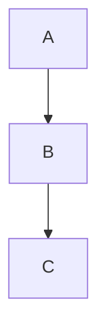

# Split-Pane Markdown Editing Implementation Plan

> **For agentic workers:** REQUIRED SUB-SKILL: Use superpowers:subagent-driven-development (recommended) or superpowers:executing-plans to implement this plan task-by-task. Steps use checkbox (`- [ ]`) syntax for tracking.

**Goal:** Add a ⌘E-toggled split view (native NSTextView editor + existing WKWebView preview) with explicit ⌘S save, sourcepos-based scroll/cursor sync, and dirty-close protection.

**Architecture:** `ViewerModel.text` becomes the single source of truth: the editor edits it, the preview renders it (debounced, with `CMARK_OPT_SOURCEPOS` so rendered blocks carry `data-sourcepos` line ranges), and `save()` writes it back in the document's original encoding. Sync is one-directional while split (editor drives preview) via two small JS helpers. The spec is at `docs/superpowers/specs/2026-07-03-split-editing-design.md`.

**Tech Stack:** Swift 6 / SwiftPM, SwiftUI + AppKit (`NSViewRepresentable`), WKWebView, cmark-gfm (vendored via swift-cmark `gfm` branch), XCTest.

## Global Constraints

- **Every `swift` command needs the Xcode toolchain:** the active developer dir is Command Line Tools, which lacks XCTest. Always run `env DEVELOPER_DIR=/Applications/Xcode.app/Contents/Developer swift test` (same for `swift build`). Plain `swift test` fails with `no such module 'XCTest'`.
- **QuickLook output must not change:** `build/quicklook.fish` compiles `Sources/tvmv/MarkdownRenderer.swift` and `Sources/tvmv/MarkdownText.swift` directly into the appex. New behavior in those files must be opt-in via parameters whose defaults preserve current output. Do not add `import SwiftUI`/`AppKit` to either file.
- **No new dependencies.** Everything uses what's already in Package.swift.
- **Tests are XCTest** (`@testable import tvmv`), files in `Tests/tvmvTests/`.
- **Commit after each task** (working tree must build and tests pass first).
- All source files live in `Sources/tvmv/`. JS lives in `Sources/tvmv/Resources/web/boot.js`.

---

### Task 1: Renderer sourcepos option

**Files:**
- Modify: `Sources/tvmv/MarkdownRenderer.swift`
- Test: `Tests/tvmvTests/MarkdownRendererTests.swift`

**Interfaces:**
- Consumes: nothing new.
- Produces: `func renderHTML(_ markdown: String, sourcePos: Bool = false) -> String`. With `sourcePos: true`, block elements (including GFM tables — verified: `extensions/table.c` calls `cmark_html_render_sourcepos`) carry `data-sourcepos="startLine:startCol-endLine:endCol"`. Default `false` output is byte-identical to today (QuickLook constraint).

- [ ] **Step 1: Write the failing tests** — append to `Tests/tvmvTests/MarkdownRendererTests.swift` inside the existing class:

```swift
    func testSourcePosEmitsDataSourcepos() {
        let html = renderHTML("# Title\n\npara\n\n| a |\n|---|\n| 1 |\n", sourcePos: true)
        XCTAssertTrue(html.contains("<h1 data-sourcepos=\"1:1-1:7\">"))
        XCTAssertTrue(html.contains("<p data-sourcepos=\"3:1-3:4\">"))
        // GFM extension blocks must carry sourcepos too (spec risk check).
        XCTAssertTrue(html.contains("<table data-sourcepos="))
    }
    func testSourcePosDefaultsOffAndOutputUnchanged() {
        // QuickLook compiles this file directly; the default must not change output.
        XCTAssertFalse(renderHTML("# Title\n\npara").contains("data-sourcepos"))
    }
```

- [ ] **Step 2: Run tests to verify the new ones fail**

Run: `env DEVELOPER_DIR=/Applications/Xcode.app/Contents/Developer swift test --filter MarkdownRendererTests`
Expected: compile FAILURE — `extra argument 'sourcePos' in call` (the parameter doesn't exist yet).

- [ ] **Step 3: Add the parameter** — in `Sources/tvmv/MarkdownRenderer.swift`, change the signature and the options line:

```swift
func renderHTML(_ markdown: String, sourcePos: Bool = false) -> String {
```

and replace `let options = CMARK_OPT_DEFAULT` with:

```swift
    // CMARK_OPT_SOURCEPOS adds data-sourcepos="line:col-line:col" to block
    // elements — the anchor the app's editor/preview sync maps through.
    let options = sourcePos ? CMARK_OPT_SOURCEPOS : CMARK_OPT_DEFAULT
```

(Update the doc comment to mention the parameter. If the exact column numbers in Step 1's `1:1-1:7`/`3:1-3:4` assertions don't match cmark's actual output, print the html and fix the *test* to the actual emitted values — the contract that matters is the attribute's presence and start line.)

- [ ] **Step 4: Run tests to verify they pass**

Run: `env DEVELOPER_DIR=/Applications/Xcode.app/Contents/Developer swift test --filter MarkdownRendererTests`
Expected: PASS (all, including the pre-existing ones).

- [ ] **Step 5: Commit**

```bash
git add Sources/tvmv/MarkdownRenderer.swift Tests/tvmvTests/MarkdownRendererTests.swift
git commit -m "Renderer: opt-in CMARK_OPT_SOURCEPOS for editor/preview sync"
```

---

### Task 2: MarkdownText.encode

**Files:**
- Modify: `Sources/tvmv/MarkdownText.swift`
- Test: `Tests/tvmvTests/MarkdownTextTests.swift` (exists — append)

**Interfaces:**
- Consumes: existing `TextEncodingUsed` enum, `MarkdownText.decode`.
- Produces: `static func encode(_ text: String, encoding: TextEncodingUsed) -> Data`. Round-trips with `decode`. Falls back to UTF-8 when the text is no longer representable in the requested encoding (e.g. emoji typed into a Latin-1 file).

- [ ] **Step 1: Write the failing tests** — append inside the existing test class in `Tests/tvmvTests/MarkdownTextTests.swift`:

```swift
    func testEncodeDecodeRoundTripUTF8() {
        let text = "# héllo → 🌍\n"
        let data = MarkdownText.encode(text, encoding: .utf8)
        let decoded = MarkdownText.decode(data)
        XCTAssertEqual(decoded.text, text)
        XCTAssertEqual(decoded.encoding, .utf8)
    }
    func testEncodeDecodeRoundTripUTF16() {
        let text = "# héllo\n"
        let data = MarkdownText.encode(text, encoding: .utf16)
        let decoded = MarkdownText.decode(data)
        XCTAssertEqual(decoded.text, text)
        XCTAssertEqual(decoded.encoding, .utf16)   // BOM must be present
    }
    func testEncodeDecodeRoundTripLatin1() {
        let text = "café\n"   // representable in Latin-1... but decode sees valid UTF-8?
        let data = MarkdownText.encode(text, encoding: .isoLatin1)
        // Latin-1 "café" bytes (é = 0xE9) are NOT valid UTF-8, so decode
        // falls through to Latin-1 — the round-trip the feature needs.
        let decoded = MarkdownText.decode(data)
        XCTAssertEqual(decoded.text, text)
        XCTAssertEqual(decoded.encoding, .isoLatin1)
    }
    func testEncodeLatin1FallsBackToUTF8WhenUnrepresentable() {
        let text = "café 🌍\n"   // emoji is not Latin-1 representable
        let data = MarkdownText.encode(text, encoding: .isoLatin1)
        XCTAssertEqual(String(data: data, encoding: .utf8), text)
    }
```

- [ ] **Step 2: Run tests to verify they fail**

Run: `env DEVELOPER_DIR=/Applications/Xcode.app/Contents/Developer swift test --filter MarkdownTextTests`
Expected: compile FAILURE — `type 'MarkdownText' has no member 'encode'`.

- [ ] **Step 3: Implement** — append inside `enum MarkdownText` in `Sources/tvmv/MarkdownText.swift`:

```swift
    /// Encode text for writing back to disk in the encoding the file was read
    /// with, so saves round-trip the original encoding. Falls back to UTF-8
    /// when the text is no longer representable (e.g. emoji typed into a
    /// Latin-1 file) — a readable file beats a failed save.
    static func encode(_ text: String, encoding: TextEncodingUsed) -> Data {
        let preferred: String.Encoding = {
            switch encoding {
            case .utf8: return .utf8
            case .utf16: return .utf16      // emits a BOM, which decode requires
            case .isoLatin1: return .isoLatin1
            }
        }()
        return text.data(using: preferred) ?? Data(text.utf8)
    }
```

- [ ] **Step 4: Run tests to verify they pass**

Run: `env DEVELOPER_DIR=/Applications/Xcode.app/Contents/Developer swift test --filter MarkdownTextTests`
Expected: PASS.

- [ ] **Step 5: Commit**

```bash
git add Sources/tvmv/MarkdownText.swift Tests/tvmvTests/MarkdownTextTests.swift
git commit -m "MarkdownText: add encode() for saving in the original encoding"
```

---

### Task 3: LineIndex — line ↔ offset conversions

**Files:**
- Create: `Sources/tvmv/LineIndex.swift`
- Test: `Tests/tvmvTests/LineIndexTests.swift` (create)

**Interfaces:**
- Consumes: nothing.
- Produces: `enum LineIndex` with `static func line(at offset: Int, in text: String) -> Int` (1-based line containing a UTF-16 offset, clamped) and `static func offset(ofLine line: Int, in text: String) -> Int` (UTF-16 offset of a 1-based line's start, clamped to the last line). NSTextView selections are UTF-16-based, and cmark sourcepos lines are 1-based — these two functions are the bridge.

- [ ] **Step 1: Write the failing tests** — create `Tests/tvmvTests/LineIndexTests.swift`:

```swift
import XCTest
@testable import tvmv

final class LineIndexTests: XCTestCase {
    let text = "line one\nline two\n\nline four"   // lines 1,2,3(empty),4

    func testLineAtOffset() {
        XCTAssertEqual(LineIndex.line(at: 0, in: text), 1)
        XCTAssertEqual(LineIndex.line(at: 8, in: text), 1)    // before the \n
        XCTAssertEqual(LineIndex.line(at: 9, in: text), 2)    // start of "line two"
        XCTAssertEqual(LineIndex.line(at: 18, in: text), 3)   // the empty line
        XCTAssertEqual(LineIndex.line(at: 19, in: text), 4)
        XCTAssertEqual(LineIndex.line(at: 999, in: text), 4)  // clamped
        XCTAssertEqual(LineIndex.line(at: 0, in: ""), 1)
    }
    func testOffsetOfLine() {
        XCTAssertEqual(LineIndex.offset(ofLine: 1, in: text), 0)
        XCTAssertEqual(LineIndex.offset(ofLine: 2, in: text), 9)
        XCTAssertEqual(LineIndex.offset(ofLine: 3, in: text), 18)
        XCTAssertEqual(LineIndex.offset(ofLine: 4, in: text), 19)
        XCTAssertEqual(LineIndex.offset(ofLine: 99, in: text), 19)  // clamped to last line
        XCTAssertEqual(LineIndex.offset(ofLine: 1, in: ""), 0)
    }
    func testUTF16Offsets() {
        // "🌍" is 2 UTF-16 units; NSTextView ranges count UTF-16, so we must too.
        let t = "a🌍\nb"
        XCTAssertEqual(LineIndex.line(at: 3, in: t), 1)   // offset 3 = the \n
        XCTAssertEqual(LineIndex.offset(ofLine: 2, in: t), 4)
    }
}
```

- [ ] **Step 2: Run to verify failure**

Run: `env DEVELOPER_DIR=/Applications/Xcode.app/Contents/Developer swift test --filter LineIndexTests`
Expected: compile FAILURE — `cannot find 'LineIndex' in scope`.

- [ ] **Step 3: Implement** — create `Sources/tvmv/LineIndex.swift`:

```swift
import Foundation

/// 1-based line ↔ UTF-16 offset conversions over a text buffer.
///
/// NSTextView selection/character ranges are UTF-16 code-unit indices and
/// cmark sourcepos lines are 1-based; these helpers bridge the two. O(n) per
/// call, which is fine for the document sizes a viewer handles and the
/// debounced call sites that use it.
enum LineIndex {
    /// The 1-based line number containing UTF-16 offset `offset` (clamped).
    static func line(at offset: Int, in text: String) -> Int {
        let s = text as NSString
        let upTo = max(0, min(offset, s.length))
        var line = 1
        for i in 0..<upTo where s.character(at: i) == 0x0A {
            line += 1
        }
        return line
    }

    /// The UTF-16 offset of the start of 1-based line `line`, clamped to the
    /// start of the last line when `line` exceeds the line count.
    static func offset(ofLine line: Int, in text: String) -> Int {
        let s = text as NSString
        var current = 1
        var start = 0
        var i = 0
        while i < s.length && current < line {
            if s.character(at: i) == 0x0A {
                current += 1
                start = i + 1
            }
            i += 1
        }
        return start
    }
}
```

- [ ] **Step 4: Run tests to verify they pass**

Run: `env DEVELOPER_DIR=/Applications/Xcode.app/Contents/Developer swift test --filter LineIndexTests`
Expected: PASS.

- [ ] **Step 5: Commit**

```bash
git add Sources/tvmv/LineIndex.swift Tests/tvmvTests/LineIndexTests.swift
git commit -m "Add LineIndex: 1-based line <-> UTF-16 offset conversions"
```

---

### Task 4: boot.js sourcepos scroll API + controller methods

**Files:**
- Modify: `Sources/tvmv/Resources/web/boot.js`
- Modify: `Sources/tvmv/MarkdownWebView.swift` (the `MarkdownWebController` class at the bottom)

**Interfaces:**
- Consumes: `data-sourcepos` attributes from Task 1 (present once the app renders with `sourcePos: true` in Task 6).
- Produces (JS, on `window.tvmv`): `topVisibleSourceLine() -> number|null`, `scrollToSourceLine(line)` (always scrolls, top-anchored), `revealSourceLine(line)` (scrolls only if the target block is outside the viewport, centered).
- Produces (Swift, on `MarkdownWebController`): `func topVisibleSourceLine() async -> Int?`, `func scrollToSourceLine(_ line: Int) async`, `func revealSourceLine(_ line: Int) async`, `func focus()`.

No JS test infra exists; the JS stays trivial and is exercised in Task 10's manual verification. The Swift additions are compile-checked here.

- [ ] **Step 1: Add the JS helpers** — in `Sources/tvmv/Resources/web/boot.js`, insert after the `setScrollRatio` function (before the `/* ---- public: find in page ---- */` section):

```js
  /* ---- public: sourcepos scroll sync ------------------------------------ */
  // Rendered blocks carry data-sourcepos="startLine:col-endLine:col" (cmark
  // CMARK_OPT_SOURCEPOS). These helpers map source lines <-> viewport position
  // for the app's editor/preview sync.

  function _sourceposStart(el) {
    var sp = el.getAttribute("data-sourcepos");
    if (!sp) return null;
    var n = parseInt(sp, 10); // "12:1-14:8" -> 12
    return isNaN(n) ? null : n;
  }

  // The deepest block whose sourcepos start is <= line (last match in document
  // order wins, so a list item beats its containing list). Falls back to the
  // first block when `line` precedes all blocks.
  function _elementForLine(line) {
    var content = document.getElementById("content");
    if (!content) return null;
    var els = content.querySelectorAll("[data-sourcepos]");
    var best = null, bestLine = -1;
    for (var i = 0; i < els.length; i++) {
      var start = _sourceposStart(els[i]);
      if (start === null) continue;
      if (start <= line && start >= bestLine) { best = els[i]; bestLine = start; }
    }
    return best || (els.length ? els[0] : null);
  }

  // Source line of the topmost visible block, preferring the deepest nested
  // block (children follow parents in document order, so a visible child
  // inside a tall container wins over the container itself).
  function topVisibleSourceLine() {
    var content = document.getElementById("content");
    if (!content) return null;
    var els = content.querySelectorAll("[data-sourcepos]");
    var best = null;
    for (var i = 0; i < els.length; i++) {
      var r = els[i].getBoundingClientRect();
      if (r.height <= 0 || r.bottom <= 0) continue;      // empty or above viewport
      if (r.top > window.innerHeight) break;             // below viewport — done
      if (best === null || best.contains(els[i])) best = els[i];
      else break;                                        // left the first visible container
    }
    return best ? _sourceposStart(best) : null;
  }

  // Scroll the block for `line` to just below the viewport top (editor-scroll sync).
  function scrollToSourceLine(line) {
    var el = _elementForLine(Number(line) || 1);
    if (!el) return;
    var rect = el.getBoundingClientRect();
    window.scrollTo(0, Math.max(0, window.scrollY + rect.top - 16));
  }

  // Scroll only if the block for `line` is fully outside the viewport (cursor
  // sync — don't yank the preview around while the target is already in view).
  function revealSourceLine(line) {
    var el = _elementForLine(Number(line) || 1);
    if (!el) return;
    var rect = el.getBoundingClientRect();
    if (rect.bottom < 0 || rect.top > window.innerHeight) {
      el.scrollIntoView({ block: "center" });
    }
  }
```

- [ ] **Step 2: Expose them** — in the `window.tvmv = { ... }` object at the bottom of boot.js, add after `setScrollRatio: setScrollRatio,`:

```js
    topVisibleSourceLine: topVisibleSourceLine,
    scrollToSourceLine: scrollToSourceLine,
    revealSourceLine: revealSourceLine,
```

- [ ] **Step 3: Add the Swift controller methods** — in `Sources/tvmv/MarkdownWebView.swift`, inside `MarkdownWebController`, after the `// MARK: Scroll position` methods:

```swift
    // MARK: Sourcepos sync (editor <-> preview mapping via data-sourcepos)

    /// Source line of the topmost visible rendered block, or nil before the
    /// first sourcepos render.
    func topVisibleSourceLine() async -> Int? {
        guard let value = await evaluate("window.tvmv.topVisibleSourceLine()") as? NSNumber else {
            return nil
        }
        return value.intValue
    }

    /// Scroll the block containing `line` to the top of the preview.
    func scrollToSourceLine(_ line: Int) async {
        await run("window.tvmv.scrollToSourceLine(\(line));")
    }

    /// Scroll the block containing `line` into view only if it is offscreen.
    func revealSourceLine(_ line: Int) async {
        await run("window.tvmv.revealSourceLine(\(line));")
    }

    /// Move keyboard focus to the web view (leaving edit mode).
    func focus() {
        guard let webView else { return }
        webView.window?.makeFirstResponder(webView)
    }
```

- [ ] **Step 4: Build**

Run: `env DEVELOPER_DIR=/Applications/Xcode.app/Contents/Developer swift build`
Expected: `Build complete!`

- [ ] **Step 5: Commit**

```bash
git add Sources/tvmv/Resources/web/boot.js Sources/tvmv/MarkdownWebView.swift
git commit -m "Web bridge: sourcepos scroll-sync API (topVisibleSourceLine, scrollTo/revealSourceLine)"
```

---

### Task 5: EditorPane + EditorController

**Files:**
- Create: `Sources/tvmv/EditorPane.swift`

**Interfaces:**
- Consumes: `LineIndex` (Task 3).
- Produces:
  - `struct EditorPosition { var cursorOffset: Int; var topLine: Int }`
  - `@MainActor final class EditorController` with: `var cursorLine: Int { get }`, `func topVisibleLine() -> Int`, `func scrollToLine(_ line: Int, placeCursor: Bool)`, `func capturePosition() -> EditorPosition`, `func restore(_ p: EditorPosition)`, `func focus()`.
  - `struct EditorPane: NSViewRepresentable` with init parameters `text: String`, `onTextChange: (String) -> Void`, `onCursorMove: () -> Void`, `onScroll: () -> Void`, `onMakeController: (EditorController) -> Void`.

UI code — verified by build here and manually in Task 10. The line math it delegates to is already unit-tested (Task 3).

- [ ] **Step 1: Create `Sources/tvmv/EditorPane.swift`:**

```swift
import SwiftUI
import AppKit

/// A captured editor location, used to restore cursor + scroll when the
/// editor pane is closed and reopened (the NSTextView itself is destroyed
/// with the pane; the position outlives it in ViewerModel).
struct EditorPosition {
    var cursorOffset: Int   // UTF-16, clamped on restore
    var topLine: Int        // 1-based
}

/// Imperative surface for the editor pane, mirroring MarkdownWebController.
/// All offsets are UTF-16 (NSTextView's native unit); lines are 1-based
/// (cmark sourcepos's unit). LineIndex converts between them.
@MainActor
final class EditorController {
    weak var textView: NSTextView?

    /// 1-based line containing the insertion point.
    var cursorLine: Int {
        guard let tv = textView else { return 1 }
        return LineIndex.line(at: tv.selectedRange().location, in: tv.string)
    }

    /// 1-based line at the top of the visible rect.
    func topVisibleLine() -> Int {
        guard let tv = textView, let lm = tv.layoutManager, let tc = tv.textContainer else {
            return 1
        }
        let topPoint = CGPoint(x: 0, y: tv.visibleRect.minY)
        let glyph = lm.glyphIndex(for: topPoint, in: tc)
        let char = lm.characterIndexForGlyph(at: glyph)
        return LineIndex.line(at: char, in: tv.string)
    }

    /// Scroll so `line` sits near the top of the pane; optionally move the
    /// insertion point to its start.
    func scrollToLine(_ line: Int, placeCursor: Bool) {
        guard let tv = textView, let lm = tv.layoutManager, let tc = tv.textContainer else {
            return
        }
        let offset = LineIndex.offset(ofLine: line, in: tv.string)
        let range = NSRange(location: offset, length: 0)
        if placeCursor { tv.setSelectedRange(range) }
        // Ensure layout exists for the target before asking for its rect.
        lm.ensureLayout(forCharacterRange: range)
        let glyphRange = lm.glyphRange(forCharacterRange: range, actualCharacterRange: nil)
        let rect = lm.boundingRect(forGlyphRange: glyphRange, in: tc)
        tv.scroll(CGPoint(x: 0, y: max(0, rect.minY - 8)))
    }

    func capturePosition() -> EditorPosition {
        EditorPosition(
            cursorOffset: textView?.selectedRange().location ?? 0,
            topLine: topVisibleLine()
        )
    }

    func restore(_ p: EditorPosition) {
        guard let tv = textView else { return }
        let clamped = min(p.cursorOffset, (tv.string as NSString).length)
        tv.setSelectedRange(NSRange(location: clamped, length: 0))
        scrollToLine(p.topLine, placeCursor: false)
    }

    func focus() {
        guard let tv = textView else { return }
        tv.window?.makeFirstResponder(tv)
    }
}

/// Plain-text Markdown editor: an NSTextView in an NSScrollView. Text flows
/// out through `onTextChange` (the model owns the string); text flows back in
/// via `updateNSView` only when it differs (external reload), so the editor's
/// own keystrokes never reset cursor or scroll.
struct EditorPane: NSViewRepresentable {
    var text: String
    var onTextChange: (String) -> Void
    var onCursorMove: () -> Void
    var onScroll: () -> Void
    var onMakeController: (EditorController) -> Void

    func makeCoordinator() -> Coordinator { Coordinator(self) }

    func makeNSView(context: Context) -> NSScrollView {
        let scroll = NSTextView.scrollableTextView()
        let tv = scroll.documentView as! NSTextView
        tv.delegate = context.coordinator
        tv.font = .monospacedSystemFont(ofSize: 13, weight: .regular)
        tv.isRichText = false
        tv.allowsUndo = true
        tv.isAutomaticQuoteSubstitutionEnabled = false
        tv.isAutomaticDashSubstitutionEnabled = false
        tv.isAutomaticTextReplacementEnabled = false
        tv.isAutomaticSpellingCorrectionEnabled = false
        tv.textContainerInset = NSSize(width: 12, height: 12)
        tv.string = text

        let controller = EditorController()
        controller.textView = tv
        context.coordinator.controller = controller
        onMakeController(controller)

        scroll.contentView.postsBoundsChangedNotifications = true
        NotificationCenter.default.addObserver(
            context.coordinator,
            selector: #selector(Coordinator.boundsChanged(_:)),
            name: NSView.boundsDidChangeNotification,
            object: scroll.contentView
        )
        return scroll
    }

    func updateNSView(_ scroll: NSScrollView, context: Context) {
        context.coordinator.parent = self
        guard let tv = scroll.documentView as? NSTextView else { return }
        if tv.string != text {
            tv.string = text
        }
    }

    @MainActor
    final class Coordinator: NSObject, NSTextViewDelegate {
        var parent: EditorPane
        var controller: EditorController?

        init(_ parent: EditorPane) { self.parent = parent }

        deinit { NotificationCenter.default.removeObserver(self) }

        func textDidChange(_ notification: Notification) {
            guard let tv = notification.object as? NSTextView else { return }
            parent.onTextChange(tv.string)
        }

        func textViewDidChangeSelection(_ notification: Notification) {
            parent.onCursorMove()
        }

        @objc func boundsChanged(_ note: Notification) {
            MainActor.assumeIsolated { parent.onScroll() }
        }
    }
}
```

(If the compiler rejects `MainActor.assumeIsolated` here because the selector method is already MainActor-inferred, simplify the body to `parent.onScroll()`. If it complains the other way — selector callable from any thread — keep it: bounds notifications for this clip view are posted on the main thread.)

- [ ] **Step 2: Build**

Run: `env DEVELOPER_DIR=/Applications/Xcode.app/Contents/Developer swift build`
Expected: `Build complete!`

- [ ] **Step 3: Run the full test suite (nothing should regress)**

Run: `env DEVELOPER_DIR=/Applications/Xcode.app/Contents/Developer swift test`
Expected: PASS.

- [ ] **Step 4: Commit**

```bash
git add Sources/tvmv/EditorPane.swift
git commit -m "Add EditorPane: NSTextView editor with line-based position API"
```

---

### Task 6: ViewerModel editing core

**Files:**
- Modify: `Sources/tvmv/ViewerModel.swift`
- Test: `Tests/tvmvTests/ViewerModelEditingTests.swift` (create)

**Interfaces:**
- Consumes: `MarkdownText.encode` (Task 2), `EditorController`/`EditorPosition` (Task 5), controller sync methods (Task 4), `renderHTML(_:sourcePos:)` (Task 1).
- Produces (on `ViewerModel`):
  - `@Published private(set) var text: String` (was `private var`)
  - `@Published var isEditing: Bool`, `@Published private(set) var isDirty: Bool`, `@Published var externalChangePending: Bool`, `@Published var saveError: String?`
  - `let encodingUsed: TextEncodingUsed`; init becomes `init(text: String, fileURL: URL?, encoding: TextEncodingUsed = .utf8)`
  - `func textEdited(_ newText: String)`, `func save()`, `func toggleEditing()`, `func discardAndReload() async`, `func attach(editor: EditorController)`, `func editorClosed()`, `func editorScrolled()`, `func editorCursorMoved()`

Reload semantics change (all headless-testable): own-save echoes are ignored by content comparison; external changes while dirty set `externalChangePending` instead of clobbering; external changes while clean update `text`.

- [ ] **Step 1: Write the failing tests** — create `Tests/tvmvTests/ViewerModelEditingTests.swift`:

```swift
import XCTest
@testable import tvmv

@MainActor
final class ViewerModelEditingTests: XCTestCase {
    private var tempURLs: [URL] = []

    private func tempFile(_ contents: String) throws -> URL {
        let url = FileManager.default.temporaryDirectory
            .appendingPathComponent("tvmv-test-\(UUID().uuidString).md")
        try contents.data(using: .utf8)!.write(to: url)
        tempURLs.append(url)
        return url
    }

    override func tearDown() {
        for url in tempURLs { try? FileManager.default.removeItem(at: url) }
        tempURLs = []
        super.tearDown()
    }

    func testTextEditedSetsDirtyAndSaveWritesAndClearsIt() throws {
        let url = try tempFile("# hello\n")
        let model = ViewerModel(text: "# hello\n", fileURL: url, encoding: .utf8)
        XCTAssertFalse(model.isDirty)
        model.textEdited("# hello world\n")
        XCTAssertTrue(model.isDirty)
        model.save()
        XCTAssertFalse(model.isDirty)
        XCTAssertNil(model.saveError)
        XCTAssertEqual(try String(contentsOf: url, encoding: .utf8), "# hello world\n")
    }

    func testEditingBackToSavedTextClearsDirty() throws {
        let url = try tempFile("a\n")
        let model = ViewerModel(text: "a\n", fileURL: url, encoding: .utf8)
        model.textEdited("ab\n")
        model.textEdited("a\n")
        XCTAssertFalse(model.isDirty)
    }

    func testReloadIgnoresOwnSaveEcho() async throws {
        // After save(), the FileWatcher will fire and call reload(); the disk
        // content equals our text, so nothing may change (no clobber loop).
        let url = try tempFile("a\n")
        let model = ViewerModel(text: "a\n", fileURL: url, encoding: .utf8)
        model.textEdited("b\n")
        model.save()
        await model.reload()
        XCTAssertEqual(model.text, "b\n")
        XCTAssertFalse(model.isDirty)
        XCTAssertFalse(model.externalChangePending)
    }

    func testExternalChangeWhileDirtySetsPendingAndKeepsEdits() async throws {
        let url = try tempFile("original\n")
        let model = ViewerModel(text: "original\n", fileURL: url, encoding: .utf8)
        model.textEdited("edited\n")
        try "external\n".data(using: .utf8)!.write(to: url)
        await model.reload()
        XCTAssertTrue(model.externalChangePending)
        XCTAssertEqual(model.text, "edited\n")   // edits never clobbered
        XCTAssertTrue(model.isDirty)
    }

    func testExternalChangeWhileCleanUpdatesText() async throws {
        let url = try tempFile("original\n")
        let model = ViewerModel(text: "original\n", fileURL: url, encoding: .utf8)
        try "external\n".data(using: .utf8)!.write(to: url)
        await model.reload()
        XCTAssertEqual(model.text, "external\n")
        XCTAssertFalse(model.isDirty)
        XCTAssertFalse(model.externalChangePending)
    }

    func testDiscardAndReloadDropsEditsAndClearsPending() async throws {
        let url = try tempFile("original\n")
        let model = ViewerModel(text: "original\n", fileURL: url, encoding: .utf8)
        model.textEdited("edited\n")
        try "external\n".data(using: .utf8)!.write(to: url)
        await model.reload()
        XCTAssertTrue(model.externalChangePending)
        await model.discardAndReload()
        XCTAssertEqual(model.text, "external\n")
        XCTAssertFalse(model.isDirty)
        XCTAssertFalse(model.externalChangePending)
    }

    func testSaveFailureSetsErrorAndStaysDirty() throws {
        let missingDir = FileManager.default.temporaryDirectory
            .appendingPathComponent("tvmv-missing-\(UUID().uuidString)")
        let url = missingDir.appendingPathComponent("f.md")   // parent doesn't exist
        let model = ViewerModel(text: "a", fileURL: url, encoding: .utf8)
        model.textEdited("b")
        model.save()
        XCTAssertNotNil(model.saveError)
        XCTAssertTrue(model.isDirty)
    }

    func testSaveRoundTripsLatin1Encoding() throws {
        let url = try tempFile("x")
        let model = ViewerModel(text: "café\n", fileURL: url, encoding: .isoLatin1)
        model.textEdited("café olé\n")
        model.save()
        let decoded = MarkdownText.decode(try Data(contentsOf: url))
        XCTAssertEqual(decoded.text, "café olé\n")
        XCTAssertEqual(decoded.encoding, .isoLatin1)
    }
}
```

- [ ] **Step 2: Run to verify failure**

Run: `env DEVELOPER_DIR=/Applications/Xcode.app/Contents/Developer swift test --filter ViewerModelEditingTests`
Expected: compile FAILURE — `extra argument 'encoding' in call`, `no member 'textEdited'`, etc.

- [ ] **Step 3: Implement in `Sources/tvmv/ViewerModel.swift`**

3a. Replace the property block and init at the top of the class:

```swift
    @Published var outline: [OutlineItem] = []
    @Published var errorMessage: String?
    @Published var findCount = 0
    @Published var findIndex = 0   // 1-based; 0 when no matches
    @Published var chromeColor: NSColor?   // lightened page background, for window + sidebar

    // MARK: Editing state
    @Published var isEditing = false
    @Published private(set) var isDirty = false
    /// The file changed on disk while there are unsaved edits; the UI shows a
    /// banner and the user decides (reload discards, save overwrites).
    @Published var externalChangePending = false
    @Published var saveError: String?

    let fileURL: URL?
    let encodingUsed: TextEncodingUsed
    @Published private(set) var text: String

    private var lastSavedText: String
    private var controller: MarkdownWebController?
    private var editorController: EditorController?
    /// Where the editor was when its pane last closed, for exact restore.
    private var savedEditorPosition: EditorPosition?
    /// Preview's top source line when the editor pane last closed; if the
    /// preview moved while the editor was hidden, re-entry re-anchors to the
    /// preview instead of restoring ("the pane you touched last wins").
    private var previewTopLineAtEditorClose: Int?
    private var renderDebounce: DispatchWorkItem?
    private var scrollSyncDebounce: DispatchWorkItem?
    private var cursorSyncDebounce: DispatchWorkItem?
    private var watcher: FileWatcher?
    private var cssWatcher: FileWatcher?
    private var isReady = false

    init(text: String, fileURL: URL?, encoding: TextEncodingUsed = .utf8) {
        self.text = text
        self.lastSavedText = text
        self.fileURL = fileURL
        self.encodingUsed = encoding
    }
```

3b. In `renderCurrent()`, change `let html = renderHTML(text)` to:

```swift
        let html = renderHTML(text, sourcePos: true)
```

3c. Replace `reload()` with (dirty/echo checks must precede the `isReady`/controller guard so the logic is headless-testable and correct before the page loads):

```swift
    /// Re-read the file from disk. Own-save echoes (disk == text) are ignored;
    /// external changes while dirty raise a banner instead of clobbering edits;
    /// otherwise adopt the new text and re-render, preserving scroll.
    func reload() async {
        guard let url = fileURL, let data = try? Data(contentsOf: url) else { return }
        let decoded = MarkdownText.decode(data).text
        if decoded == text { return }                       // our own save echoing back
        if isDirty {
            externalChangePending = true                    // user decides; never clobber
            return
        }
        text = decoded
        lastSavedText = decoded
        guard isReady, let controller else { return }
        let ratio = await controller.getScrollRatio()
        await renderCurrent()
        try? await Task.sleep(nanoseconds: 60_000_000) // let layout settle
        await controller.setScrollRatio(ratio)
    }

    /// Banner action: drop unsaved edits and adopt the on-disk content.
    func discardAndReload() async {
        isDirty = false
        externalChangePending = false
        text = lastSavedText   // force reload's echo-check to see a difference
        await reload()
    }
```

(Note in `discardAndReload`: if the external content happens to equal `lastSavedText`, reload's echo check correctly does nothing — the file is back to what we had.)

3d. Add the editing API after `attach(controller:)`:

```swift
    // MARK: Editing

    func attach(editor: EditorController) {
        editorController = editor
        Task { await positionEditorOnOpen() }
    }

    /// The editor pane is closing (⌘E off): remember where it was, and where
    /// the preview was, so re-entry can decide between restore and re-anchor.
    func editorClosed() {
        savedEditorPosition = editorController?.capturePosition()
        editorController = nil
        Task { previewTopLineAtEditorClose = await controller?.topVisibleSourceLine() }
        controller?.focus()
    }

    func toggleEditing() {
        if isEditing {
            isEditing = false
            editorClosed()
        } else {
            saveError = nil
            isEditing = true
            // EditorPane's makeNSView calls attach(editor:), which positions
            // and focuses; nothing more to do here.
        }
    }

    /// Entry positioning: restore the exact previous spot when the preview
    /// didn't move while the editor was hidden; otherwise (or on first open)
    /// anchor to the preview's topmost visible source line.
    private func positionEditorOnOpen() async {
        guard let editor = editorController else { return }
        let previewLine = await controller?.topVisibleSourceLine()
        if let saved = savedEditorPosition, previewLine == previewTopLineAtEditorClose {
            editor.restore(saved)
        } else {
            editor.scrollToLine(previewLine ?? 1, placeCursor: true)
        }
        editor.focus()
    }

    /// Editor keystrokes: adopt the text, track dirtiness, and re-render the
    /// preview debounced, re-anchored to the editor's viewport afterward.
    func textEdited(_ newText: String) {
        guard newText != text else { return }
        text = newText
        isDirty = (newText != lastSavedText)
        renderDebounce?.cancel()
        let work = DispatchWorkItem { [weak self] in
            Task { @MainActor [weak self] in await self?.renderAfterEdit() }
        }
        renderDebounce = work
        DispatchQueue.main.asyncAfter(deadline: .now() + 0.25, execute: work)
    }

    private func renderAfterEdit() async {
        await renderCurrent()
        try? await Task.sleep(nanoseconds: 60_000_000) // let layout settle
        if let editor = editorController {
            await controller?.scrollToSourceLine(editor.topVisibleLine())
        }
    }

    /// Editor scrolled: keep the preview's top aligned (debounced).
    func editorScrolled() {
        guard isEditing else { return }
        scrollSyncDebounce?.cancel()
        let work = DispatchWorkItem { [weak self] in
            guard let self, let editor = self.editorController else { return }
            let line = editor.topVisibleLine()
            Task { @MainActor in await self.controller?.scrollToSourceLine(line) }
        }
        scrollSyncDebounce = work
        DispatchQueue.main.asyncAfter(deadline: .now() + 0.15, execute: work)
    }

    /// Cursor moved: bring its block into the preview only if offscreen.
    func editorCursorMoved() {
        guard isEditing else { return }
        cursorSyncDebounce?.cancel()
        let work = DispatchWorkItem { [weak self] in
            guard let self, let editor = self.editorController else { return }
            let line = editor.cursorLine
            Task { @MainActor in await self.controller?.revealSourceLine(line) }
        }
        cursorSyncDebounce = work
        DispatchQueue.main.asyncAfter(deadline: .now() + 0.15, execute: work)
    }

    // MARK: Save

    /// Write `text` back to the file in its original encoding. Synchronous so
    /// the window-close guard can save-and-close in one step.
    func save() {
        guard let url = fileURL, isDirty else { return }
        do {
            try MarkdownText.encode(text, encoding: encodingUsed)
                .write(to: url, options: .atomic)
            lastSavedText = text
            isDirty = false
            externalChangePending = false   // we just overwrote the external change
            saveError = nil
        } catch {
            saveError = error.localizedDescription
        }
    }
```

- [ ] **Step 4: Run the new tests, then the full suite**

Run: `env DEVELOPER_DIR=/Applications/Xcode.app/Contents/Developer swift test --filter ViewerModelEditingTests`
Expected: PASS.
Run: `env DEVELOPER_DIR=/Applications/Xcode.app/Contents/Developer swift test`
Expected: PASS (nothing regressed).

- [ ] **Step 5: Commit**

```bash
git add Sources/tvmv/ViewerModel.swift Tests/tvmvTests/ViewerModelEditingTests.swift
git commit -m "ViewerModel: editing state, save with encoding round-trip, safe reload semantics"
```

---

### Task 7: ViewerWindow split layout + wiring

**Files:**
- Modify: `Sources/tvmv/ViewerWindow.swift`
- Modify: `Sources/tvmv/AppSettings.swift`

**Interfaces:**
- Consumes: `EditorPane` (Task 5), ViewerModel editing API (Task 6).
- Produces: the split UI. `AppSettings` gains `@Published var editorPaneWidth: Double` (0 = unset, persisted under key `"editorPaneWidth"`). `ViewerModel` is now constructed with the document's encoding.

- [ ] **Step 1: Add the width setting** — in `Sources/tvmv/AppSettings.swift`:

Add to the `@Published` block:

```swift
    @Published var editorPaneWidth: Double { didSet { d.set(editorPaneWidth, forKey: K.editorPaneWidth) } }
```

Add to `enum K`:

```swift
        static let editorPaneWidth = "editorPaneWidth"
```

Add to `init` (with the other reads):

```swift
        editorPaneWidth = defaults.object(forKey: K.editorPaneWidth) as? Double ?? 0
```

- [ ] **Step 2: Wire the document's encoding through** — in `Sources/tvmv/ViewerWindow.swift`, change the `init`'s StateObject line to:

```swift
        _model = StateObject(wrappedValue: ViewerModel(
            text: document.text, fileURL: fileURL, encoding: document.encodingUsed))
```

- [ ] **Step 3: Replace the `detail:` closure** of the `NavigationSplitView` with:

```swift
        } detail: {
            HSplitView {
                if model.isEditing {
                    editorPane
                        .frame(minWidth: 280,
                               idealWidth: settings.editorPaneWidth > 0
                                   ? CGFloat(settings.editorPaneWidth) : nil)
                        .overlay(alignment: .top) {
                            if model.externalChangePending { externalChangeBanner }
                        }
                        .background(GeometryReader { geo in
                            Color.clear.onChange(of: geo.size.width) { _, w in
                                settings.editorPaneWidth = Double(w)
                            }
                        })
                }
                webView
                    .frame(minWidth: 320)
                    .overlay(alignment: .topTrailing) { if showFind { findBar } }
            }
        }
```

- [ ] **Step 4: Add the editor pane and banner views** — after the existing `private var webView` property:

```swift
    private var editorPane: some View {
        EditorPane(
            text: model.text,
            onTextChange: { model.textEdited($0) },
            onCursorMove: { model.editorCursorMoved() },
            onScroll: { model.editorScrolled() },
            onMakeController: { model.attach(editor: $0) }
        )
    }

    private var externalChangeBanner: some View {
        HStack(spacing: 8) {
            Image(systemName: "exclamationmark.triangle.fill")
                .foregroundStyle(.orange)
            Text("File changed on disk")
                .font(.caption)
            Spacer()
            Button("Reload (discards edits)") {
                Task { await model.discardAndReload() }
            }
            .font(.caption)
        }
        .padding(.horizontal, 10)
        .padding(.vertical, 6)
        .background(.thinMaterial, in: RoundedRectangle(cornerRadius: 8))
        .overlay(RoundedRectangle(cornerRadius: 8).strokeBorder(.quaternary))
        .padding(8)
    }
```

- [ ] **Step 5: Surface save errors** — add to the modifier chain on the `NavigationSplitView` (next to the other `.onChange` modifiers):

```swift
        .alert("Save Failed", isPresented: Binding(
            get: { model.saveError != nil },
            set: { if !$0 { model.saveError = nil } }
        )) {
            Button("OK", role: .cancel) {}
        } message: {
            Text(model.saveError ?? "")
        }
```

- [ ] **Step 6: Build and run existing tests**

Run: `env DEVELOPER_DIR=/Applications/Xcode.app/Contents/Developer swift build && env DEVELOPER_DIR=/Applications/Xcode.app/Contents/Developer swift test`
Expected: build succeeds, all tests PASS.

- [ ] **Step 7: Commit**

```bash
git add Sources/tvmv/ViewerWindow.swift Sources/tvmv/AppSettings.swift
git commit -m "ViewerWindow: split edit layout with banner, save alert, persisted pane width"
```

---

### Task 8: Menu commands — Toggle Editing (⌘E) and Save (⌘S)

**Files:**
- Modify: `Sources/tvmv/ViewerCommands.swift`
- Modify: `Sources/tvmv/ViewerWindow.swift` (the `focusedSceneValue` call)

**Interfaces:**
- Consumes: `model.toggleEditing()`, `model.save()`, `model.isDirty` (Task 6).
- Produces: `ViewerCommands` gains `toggleEditing: () -> Void`, `save: () -> Void`, `canSave: Bool`, `canEdit: Bool`. Menu items: "Toggle Editing" ⌘E (File-adjacent group), "Save" ⌘S (disabled unless dirty). ⌘E follows the Obsidian convention for edit/preview toggling.

- [ ] **Step 1: Extend the struct** — in `Sources/tvmv/ViewerCommands.swift`, replace the `ViewerCommands` struct with:

```swift
struct ViewerCommands {
    var find: () -> Void
    var printDocument: () -> Void
    var reload: () -> Void
    var toggleOutline: () -> Void
    var toggleEditing: () -> Void
    var save: () -> Void
    /// Enables ⌘S: there are unsaved edits and a file to write to.
    var canSave: Bool
    /// Enables ⌘E: the document has a file URL to save back to.
    var canEdit: Bool
}
```

- [ ] **Step 2: Add the menu items** — in `ViewerMenuCommands.body`, inside the existing `CommandGroup(after: .newItem)`, add BEFORE the Reload button:

```swift
            Button("Save") { commands?.save() }
                .keyboardShortcut("s", modifiers: .command)
                .disabled(commands?.canSave != true)
            Divider()
```

and inside the existing `CommandGroup(after: .toolbar)`, add after the Toggle Outline button:

```swift
            Button("Toggle Editing") { commands?.toggleEditing() }
                .keyboardShortcut("e", modifiers: .command)
                .disabled(commands?.canEdit != true)
```

- [ ] **Step 3: Publish the new actions** — in `Sources/tvmv/ViewerWindow.swift`, replace the `.focusedSceneValue(\.viewerCommands, ...)` call with:

```swift
        .focusedSceneValue(\.viewerCommands, ViewerCommands(
            find: {
                showFind = true
                // Defer focus until the bar is in the hierarchy this runloop turn.
                DispatchQueue.main.async { findFocused = true }
            },
            printDocument: { model.printDoc() },
            reload: { Task { await model.reload() } },
            toggleOutline: { columns = (columns == .detailOnly) ? .all : .detailOnly },
            toggleEditing: { model.toggleEditing() },
            save: { model.save() },
            canSave: model.isDirty && fileURL != nil,
            canEdit: fileURL != nil
        ))
```

- [ ] **Step 4: Build and test**

Run: `env DEVELOPER_DIR=/Applications/Xcode.app/Contents/Developer swift build && env DEVELOPER_DIR=/Applications/Xcode.app/Contents/Developer swift test`
Expected: build succeeds, all tests PASS.

- [ ] **Step 5: Commit**

```bash
git add Sources/tvmv/ViewerCommands.swift Sources/tvmv/ViewerWindow.swift
git commit -m "Menus: Toggle Editing (Cmd-E) and Save (Cmd-S)"
```

---

### Task 9: Dirty-close protection (window close + app quit)

**Files:**
- Create: `Sources/tvmv/WindowCloseGuard.swift`
- Modify: `Sources/tvmv/ViewerWindow.swift` (attach the guard)
- Modify: `Sources/tvmv/App.swift` (quit guard)

**Interfaces:**
- Consumes: `model.isDirty`, `model.save()` (Task 6).
- Produces: `WindowCloseGuard: NSViewRepresentable` (takes `isDirty: () -> Bool` and `save: () -> Bool`, where `save` returns whether the window may close). Also keeps `NSWindow.isDocumentEdited` in sync (the titlebar dirty dot). `AppDelegate.applicationShouldTerminate` routes ⌘Q through the same per-window prompt.

This is the spec's flagged risky integration (proxying SwiftUI's window delegate). The proxy forwards every other delegate message to the original via `forwardingTarget(for:)`, and holds the original strongly (NSWindow.delegate is weak; without this the original could deallocate).

- [ ] **Step 1: Create `Sources/tvmv/WindowCloseGuard.swift`:**

```swift
import SwiftUI
import AppKit

/// Attaches a Save/Don't Save/Cancel prompt to the hosting window's close
/// button when there are unsaved edits, and mirrors the dirty state into the
/// titlebar dot (`isDocumentEdited`).
///
/// SwiftUI owns the window's delegate, so we install a proxy that intercepts
/// only `windowShouldClose` and forwards everything else to the original.
struct WindowCloseGuard: NSViewRepresentable {
    /// Read live from the model on each close attempt.
    var isDirty: () -> Bool
    /// Attempt to save; return true when the window may close (save succeeded
    /// or there was nothing to save).
    var save: () -> Bool

    func makeCoordinator() -> CloseGuardDelegate { CloseGuardDelegate() }

    func makeNSView(context: Context) -> NSView { NSView() }

    func updateNSView(_ nsView: NSView, context: Context) {
        let proxy = context.coordinator
        proxy.isDirty = isDirty
        proxy.save = save
        let dirty = isDirty()
        DispatchQueue.main.async {
            guard let window = nsView.window else { return }
            if window.delegate !== proxy {
                proxy.original = window.delegate
                window.delegate = proxy
            }
            window.isDocumentEdited = dirty
        }
    }
}

/// Proxy window delegate: intercepts `windowShouldClose`, forwards the rest.
final class CloseGuardDelegate: NSObject, NSWindowDelegate {
    /// Held strongly: NSWindow.delegate is weak, and once we replace it we may
    /// be the only thing keeping SwiftUI's delegate alive.
    var original: NSWindowDelegate?
    var isDirty: () -> Bool = { false }
    var save: () -> Bool = { true }

    func windowShouldClose(_ sender: NSWindow) -> Bool {
        guard isDirty() else {
            return original?.windowShouldClose?(sender) ?? true
        }
        let alert = NSAlert()
        alert.messageText = "Do you want to save the changes made to “\(sender.title)”?"
        alert.informativeText = "Your changes will be lost if you don't save them."
        alert.addButton(withTitle: "Save")
        alert.addButton(withTitle: "Cancel")
        alert.addButton(withTitle: "Don't Save")
        switch alert.runModal() {
        case .alertFirstButtonReturn:            // Save
            guard save() else { return false }   // save failed — keep the window
            return original?.windowShouldClose?(sender) ?? true
        case .alertThirdButtonReturn:            // Don't Save
            return original?.windowShouldClose?(sender) ?? true
        default:                                 // Cancel
            return false
        }
    }

    override func responds(to aSelector: Selector!) -> Bool {
        super.responds(to: aSelector) || (original?.responds(to: aSelector) ?? false)
    }

    override func forwardingTarget(for aSelector: Selector!) -> Any? {
        if let original, original.responds(to: aSelector) { return original }
        return super.forwardingTarget(for: aSelector)
    }
}
```

- [ ] **Step 2: Attach it** — in `Sources/tvmv/ViewerWindow.swift`, directly after the existing `.background { WindowChrome(color: model.chromeColor) }` line, add:

```swift
        .background { WindowCloseGuard(
            isDirty: { model.isDirty },
            save: { model.save(); return !model.isDirty }
        ) }
```

(The closures capture `model`, a reference type, so they always read live state.)

- [ ] **Step 3: Guard ⌘Q** — in `Sources/tvmv/App.swift`, add above `@main`:

```swift
/// Routes app termination through each dirty window's close prompt, so ⌘Q
/// can't silently drop unsaved edits (windowShouldClose is not consulted
/// during termination otherwise).
final class AppDelegate: NSObject, NSApplicationDelegate {
    func applicationShouldTerminate(_ sender: NSApplication) -> NSApplication.TerminateReply {
        for window in sender.windows where window.isDocumentEdited {
            window.makeKeyAndOrderFront(nil)
            let mayClose = window.delegate?.windowShouldClose?(window) ?? true
            if !mayClose { return .terminateCancel }
        }
        return .terminateNow
    }
}
```

and inside `struct TvmvApp`, add below the `@StateObject` line:

```swift
    @NSApplicationDelegateAdaptor(AppDelegate.self) private var appDelegate
```

- [ ] **Step 4: Build and test**

Run: `env DEVELOPER_DIR=/Applications/Xcode.app/Contents/Developer swift build && env DEVELOPER_DIR=/Applications/Xcode.app/Contents/Developer swift test`
Expected: build succeeds, all tests PASS.

- [ ] **Step 5: Commit**

```bash
git add Sources/tvmv/WindowCloseGuard.swift Sources/tvmv/ViewerWindow.swift Sources/tvmv/App.swift
git commit -m "Guard dirty windows: close prompt, titlebar dot, quit interception"
```

---

### Task 10: Bundle + manual verification

**Files:**
- No source changes expected (fixes discovered here get their own commits).

The sync/focus behavior lives across NSTextView, WKWebView, and JS — it can only be verified in the running app.

- [ ] **Step 1: Create a test document** exercising every sync-relevant feature:

```bash
cat > /private/tmp/claude-501/-Users-ulfnielsen-dev-tvmv/a3f50bf6-65b2-4388-8669-c9083c0fdf16/scratchpad/edit-test.md <<'EOF'
# Edit test

Intro paragraph.

## Math

Inline $e^{i\pi}+1=0$ and display:

$$\int_0^\infty e^{-x^2}\,dx = \frac{\sqrt{\pi}}{2}$$

## Diagram



## Table

| col a | col b |
|-------|-------|
| 1     | 2     |

## Long section

EOF
for i in $(seq 1 60); do echo -e "Paragraph $i with some text to make the document scroll.\n" >> /private/tmp/claude-501/-Users-ulfnielsen-dev-tvmv/a3f50bf6-65b2-4388-8669-c9083c0fdf16/scratchpad/edit-test.md; done
```

- [ ] **Step 2: Build and install the bundle**

Run: `env DEVELOPER_DIR=/Applications/Xcode.app/Contents/Developer fish build/bundle.fish`
Expected: `dist/tvmv.app` assembled, installed to `~/Applications`.

- [ ] **Step 3: Open the test document and walk the checklist**

Run: `~/Applications/tvmv.app/Contents/MacOS/tvmv /private/tmp/claude-501/-Users-ulfnielsen-dev-tvmv/a3f50bf6-65b2-4388-8669-c9083c0fdf16/scratchpad/edit-test.md` (or `open -a tvmv <path>`)

Verify each; check off only what actually passed:

1. **⌘E entry anchor:** scroll the preview to "Paragraph 30", press ⌘E → editor opens scrolled to that paragraph's source line, cursor on it, keyboard focus in the editor (typing inserts immediately).
2. **Live preview:** type text into a paragraph → preview updates within ~a second without jumping; outline updates when a heading is edited.
3. **Editor→preview scroll sync:** scroll the editor → preview follows, including across the mermaid/KaTeX/table sections.
4. **Cursor reveal:** click a line whose block is offscreen in the preview → preview scrolls it into view; moving the cursor within a visible block does NOT scroll the preview.
5. **⌘E exit:** press ⌘E → editor closes, preview stays put, focus back on the preview (arrow keys scroll it).
6. **Re-entry restore:** ⌘E again without touching the preview → cursor and editor scroll exactly where they were. Then: exit, scroll the preview elsewhere, ⌘E → editor re-anchors to the new preview position.
7. **Save:** edit, note the titlebar dirty dot, ⌘S → dot clears, file on disk has the change (`cat` it), and the preview does NOT flash/reload from the watcher echo.
8. **External change, clean:** with no unsaved edits, `echo "appended" >> <file>` from a terminal → both panes update.
9. **External change, dirty:** edit without saving, append externally again → banner appears, editor keeps the unsaved text; click the banner's Reload → edits discarded, disk content shown.
10. **Close guard:** edit without saving, click the window close button → Save/Don't Save/Cancel alert; verify all three buttons. Repeat with ⌘Q.
11. **Divider persistence:** drag the split divider, quit, reopen, ⌘E → width restored.
12. **Menus:** Save disabled when not dirty; Toggle Editing disabled on no window; ⌘R, ⌘F, ⌘P, ⌘⇧0 all still work.

Added during the final review (validate the review fixes):

13. **Hidden-banner path:** edit → ⌘E off → append to the file externally → the banner must appear over the *preview*; ⌘R while dirty must show it too (never a silent no-op).
14. **Toggle-off during debounce:** type a character and press ⌘E within ~¼ s in the mermaid/KaTeX doc → preview must not jump.
15. **Undo across reload:** clean-reload externally while the editor is open, then ⌘Z; and discard-reload then ⌘Z — nothing may resurrect or garble.
16. **⌘Q immediately after the first-ever keystroke** in a freshly opened window → the save prompt must still appear.
17. **Save onto a read-only file** (`chmod 444`): Save Failed alert, stays dirty; closing the window and choosing "Save" must keep the window open.
18. **Banner + find bar together:** with the banner showing, press ⌘F — both must remain usable (known cosmetic overlap top-right; judge acceptability).

- [ ] **Step 4: Fix anything that failed** (each fix: reproduce → fix → re-verify → its own commit), then re-run the full suite:

Run: `env DEVELOPER_DIR=/Applications/Xcode.app/Contents/Developer swift test`
Expected: PASS.

- [ ] **Step 5: Final commit if any docs/plan checkboxes changed**

```bash
git add -A docs/
git commit -m "Split editing: mark manual verification complete"
```
